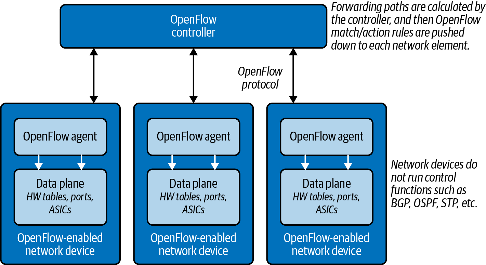
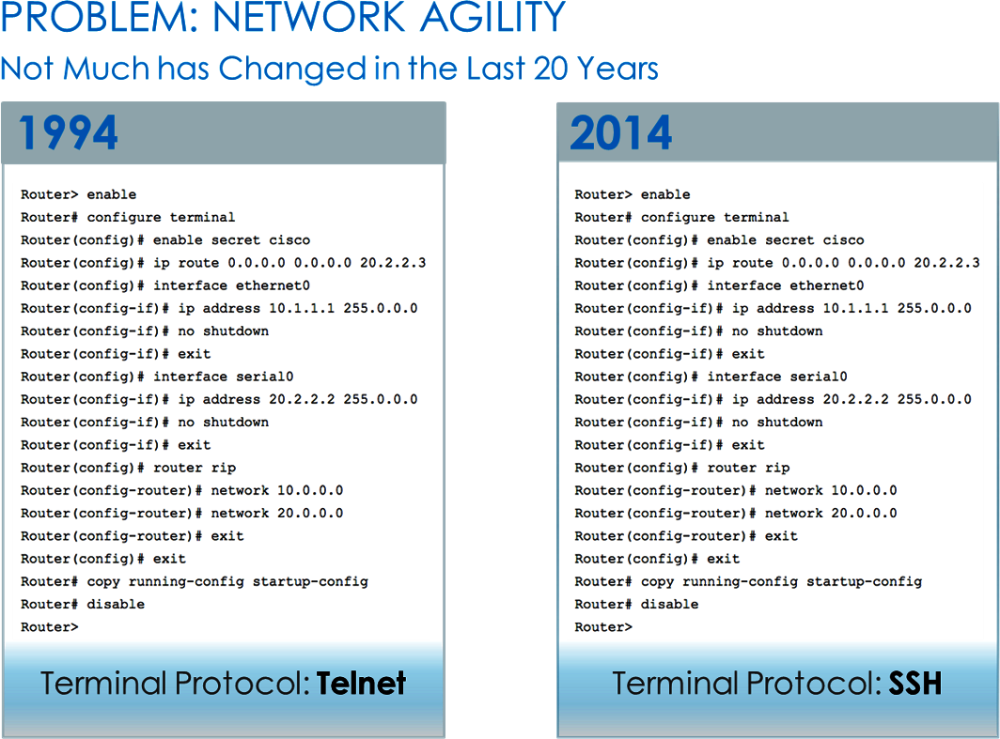
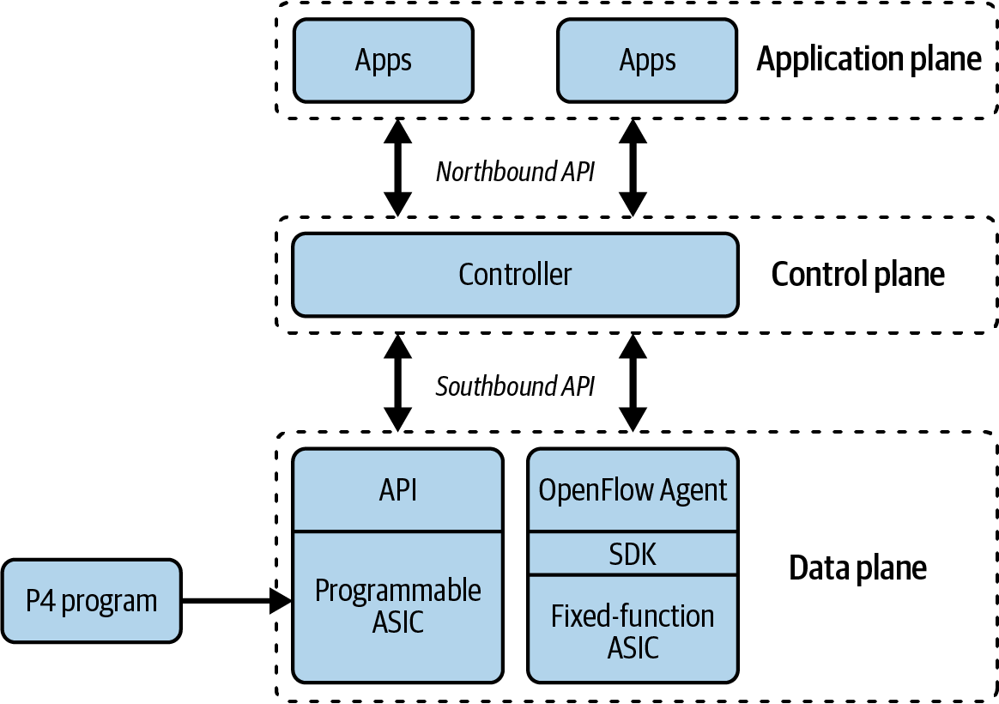
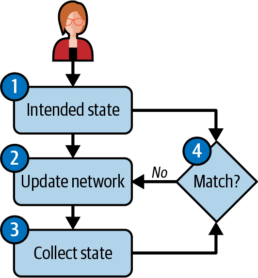
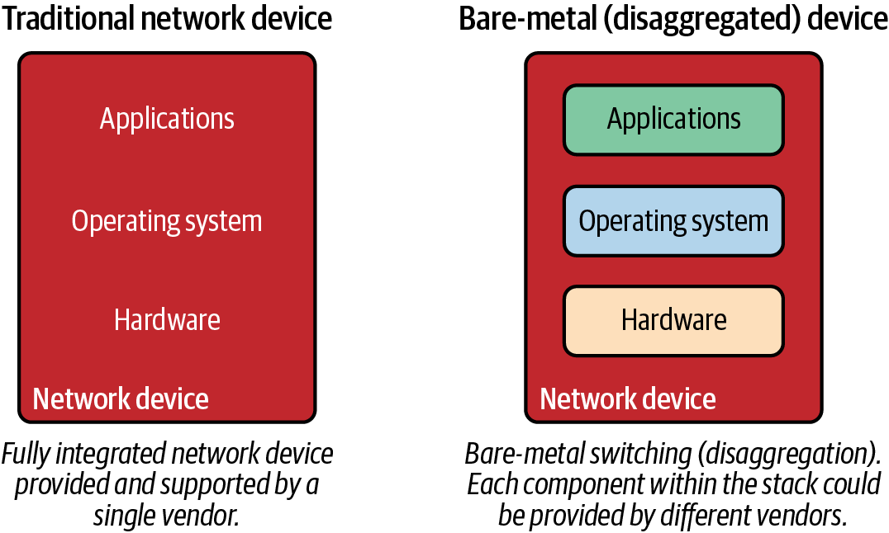
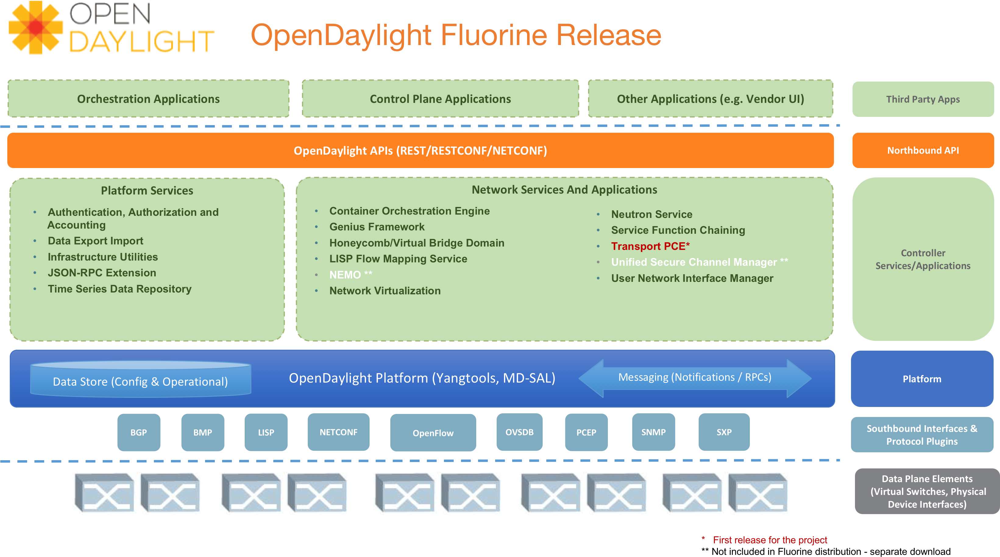

## CHAPTER 1
## Network Industry Trends
More than a decade has passed since the term software-defined networking (SDN) was coined, representing one of the biggest revolutions in the networking industry since the 1990s, and likely the term is still confusing you. Whether you are new to SDN or have been hung up in its craze for the past several years, don’t worry. This book will walk you through foundational topics to start your journey of understanding how software, the cloud, and open source have completely transformed the way we architect and manage networking in the modern era.

This chapter provides insight into trends in the network industry focused on SDN, its relevance, and its impact in today’s world of networking. We’ll get started by reviewing how SDN made it into the mainstream and ultimately led to network programmability and automation practices.

### The Rise of Software-Defined Networking

If one person could be credited with all the change occurring in the network
industry, it would be Martin Casado, a general partner in the venture capitalist
company Andreessen Horowitz. Previously, Casado was a VMware fellow, senior vice
president, and general manager in the Networking and Security Business Unit at
VMware. He has had a profound impact on the industry, not just from his direct
contributions (including OpenFlow and Nicira), but by opening the eyes of large
network incumbents and showing that network operations, agility, and manageability must change. Let’s take a look at this history in a little more detail.

### The Advent of OpenFlow

For better or worse, OpenFlow served as the first major protocol of the SDN movement. Casado worked on OpenFlow while earning his PhD at Stanford University, 1under the supervision of Nick McKeown. The OpenFlow protocol allows for the decoupling of a network device’s control plane from the data plane (see Figure 1-1). In simplest terms, the control plane can be thought of as the brains of a network device, and the data plane can be thought of as the hardware or application-specific integrated circuits (ASICs) that perform packet forwarding.

Figure 1-1. Decoupling the control plane and data plane with OpenFlow

    Figure 1-1 depicts the network devices having no control plane. This represents a pure OpenFlow-only deployment. Many devices also support running OpenFlow in a hybrid mode, meaning OpenFlow can be deployed on a given port, virtual local area network (VLAN), or even within a normal packet-forwarding pipeline. Then, there is no match in the OpenFlow table, the existing forwarding tables—media access control (MAC) routing, etc.—are used, making packet forwarding more analogous to policy-based routing (PBR).
    
This means OpenFlow is a low-level protocol used to directly interface with the
hardware tables (e.g., forwarding information base, or FIB) that instruct a network device on how to forward traffic (for example, “traffic to destination 192.168.0.100 should egress port 48”).

    OpenFlow is a low-level protocol that manipulates flow tables, thus directly impacting packet forwarding. OpenFlow is not intended to interact with management plane attributes like authentication or Simple Network Management Protocol (SNMP) parameters.

Because the tables OpenFlow uses support more than the destination address as compared to traditional routing protocols, OpenFlow offers more granularity (matching fields in the packet) to determine the forwarding path. This is not unlike the granularity offered by PBR to decide the next routing hop by taking into account the source address. As OpenFlow would do many years later, PBR allows network administrators to forward traffic based on “nontraditional” attributes, like a packet’s source address. However, it took quite some time for network vendors to offer equivalent performance for traffic that was forwarded via PBR, and the final result was still very vendor specific.

The advent of OpenFlow meant that we could achieve the same granularity with
traffic-forwarding decisions but in a vendor-neutral way. It became possible to
enhance the capabilities of the network infrastructure without waiting for the next version of hardware from the manufacturer.

---
##### History of Programmable Networks
OpenFlow was not the first protocol or technology used to decouple control func‐
tions and intelligence from network devices. A long history of technology and
research predates OpenFlow, although OpenFlow is the technology that started the
SDN revolution. A few of the earlier technologies include Forwarding and Control
Element Separation (ForCES), active networks, routing control platform (RCP), and path computation element (PCE). For a more in-depth look at this history, take a look at the paper “The Road to SDN: An Intellectual History of Programmable Networks” by Nick Feamster et al.

---

### Why OpenFlow?
While it’s important to understand what OpenFlow is, it’s even more important to
understand the reasoning behind the research and development effort of the original OpenFlow spec that led to the rise of SDN.

Casado had a job working for the United States government while he was attending
Stanford. At that time, the government needed to react to security attacks on its IT systems (after all, this is the US government). Casado quickly realized that he was able to program and manipulate the computers and servers as needed. The actual use cases were never publicized, but it was this type of control over endpoints that made it possible to react, analyze, and potentially reprogram a host or group of hosts when and if needed.

When it came to the network, it was nearly impossible to do this cleanly and programmatically. After all, each network device was closed (locked from installing third-party software, for example) and had only a command-line interface (CLI). Although the CLI was and is still well known and even preferred by network administrators, it was clear to Casado that it did not offer the flexibility required to truly manage, operate, and secure a network.

In reality, the way networks were managed had never changed in more than 20 years except for the addition of CLI commands for new features. The biggest change was the migration from the Telnet to the Secure Shell (SSH) protocol, which was a joke often used by the SDN company Big Switch Networks in its slides, as you can see in Figure 1-2.

Figure 1-2. What’s changed? From Telnet to SSH (image source: Big Switch Networks, acquired by Arista Networks)

All joking aside, the management of networks has lagged behind other technologies quite drastically, and this is what Casado eventually set out to change over the next several years. This lack of manageability is often better understood when other technologies are examined. Other technologies almost always have more modern ways of managing many devices for both configuration management and data gathering and analysis—for example, hypervisor managers, wireless controllers, IP PBXs (i.e., private IP telephony exchange), PowerShell, DevOps tools, and the list goes on. Some of these are tightly coupled to vendors as commercial software, but others are more loosely aligned to allow for multiplatform management, operations, and agility.

If we go back to the scenario Casado encountered while working for the government, what sort of questions came up when looking for answers? Was it possible to redirect traffic based on the application? Did network devices have an application programming interface (API)? Was there a single point of communication to the network?
The answers were largely no across the board. How could it be possible to program the network to dynamically control packet forwarding, policy, and configuration as easily as it was to write a program and have it on an end host machine?
The initial OpenFlow spec was the result of Casado experiencing these types of problems firsthand. While the hype around OpenFlow has died down since the industry started to finally focus more on use cases and solutions than low-level protocols, this initial work was the catalyst for the entire industry to rethink the way networks are built, managed, and operated. Thank you, Martin.
This also means if it weren’t for Casado, this book may never have been written!

### What Is Software-Defined Networking?

We’ve introduced OpenFlow, but what is software-defined networking? Are they the
same thing, different things, or neither? To be honest, SDN is just like the cloud was more than a decade ago, before we knew about different types of cloud, such as infrastructure as a service (IaaS), platform as a service (PaaS), and software as a service (SaaS).
Having reference examples and designs streamlines our understanding of the cloud
over time, but even before these terms existed, it could be debated that when you saw the cloud, you knew it. That’s kind of where we are with SDN. Some definitions state that white-box networking is SDN or that having an API on a network device is SDN.
Are they really SDN? Not really.
Rather than attempt to define SDN, this chapter covers the following technologies
and trends that are often thought of as SDN and included in the SDN conversation:
• Opening up the data plane• Bare-metal switching
• Network functions virtualization• Data center network fabrics
• Virtual switching• Software-defined WAN
• Network virtualization• Controller networking
• Device APIs• Cloud native networking
• Network automation

    We are intentionally not defining SDN in this book. While SDN is mentioned in this chapter, our primary focus is on general trends that are often categorized as SDN to ensure that you’re aware of each trend more specifically.

Of these trends, the rest of the book focuses on network automation, APIs, and
peripheral technologies that are critical in understanding how all the pieces come together in network devices that expose programmatic interfaces with modern automation tools and instrumentation.

Aside from the previous list, other technologies and patterns not directly related to networking will continue to have a big impact on the way networks are built and operated. For instance, artificial intelligence/machine learning (AI/ML) solutions will bring new capabilities to help make educated decisions when designing a new network, proposing an optimization change, or learning about normal traffic patterns to detect outliers. Keep your mind open to all the new opportunities that will appear in tech, and consider how they can be used in the networking field.

### Opening Up the Data Plane

OpenFlow was the main disruptor to expose the benefits of opening up the data
plane and allowing its control by external control planes. This separation enabled the independence of the software controller and the underlying network. To make this possible, OpenFlow came up with its abstract standard modeling that was not able to support vendors’ extensions, and with predefined packet-processing pipelines (i.e., how a packet traverses the ASICs) and predefined data structures, both to allow OpenFlow to change the forwarding path in runtime. These limitations, and others, made evident OpenFlow was not capable of solving the decoupling of control and data plane because of the challenges of a centralized control plane at scale.

    No changes in OpenFlow standard development have been published since release 1.5.1 in 2017, and its adoption is limited to specific use cases.

Understanding some of the limitations in OpenFlow raises new questions:
• Why must these packet-processing pipelines be fixed?
• Why can’t we define new data structures?
Barefoot Networks, acquired by Intel, answered that call, creating a new family of high-performing chips (Tofino) with a full programmable execution pipeline, along with a new programming language, Programming Protocol-Independent Packet Processors, or P4.

    P4 and OpenFlow protocol specifications are driven by the same organization, the Open Networking Foundation, or ONF.
This new disruptive approach challenged the status quo of the silicon switch market. Broadcom, the biggest player in the game, launched Network Programming
Language, or NPL, as an alternative programmable solution (with a limited set of
configurable options) and also made a significant move to offer an easier way to
program its chips by opening its OpenBCM SDK in 2020. Other players have also
adopted some level of programmability. For instance, Cisco Silicon One and Juniper Trio/Penta solutions support P4 programmability.

    Traditionally, ASICs have been programmed (with the constraints of a fixed-processing pipeline) via chip vendors’ SDKs, which expose the pre-created data structures and methods to define how the packet forwarding will be executed (taking into account the forwarding state data).
    A few years ago, chip vendors started to open their SDKs that were previously shared by request and under nondisclosure agreements (NDAs), to facilitate the third-party programmability of their solutions. This change was likely motivated by the industry to push toward the low-level programmability of ASICs.
    
These highly customizable ASICs have a limited market today because of the higher cost and some technical constraints; some market forecasts show a significant increase in adoption in the coming years. Time will tell how this market evolves (for example, Intel announced the halt of Tofino chip development in 2023) and which use cases will benefit the most from the flexibility that these programmable pipelines offer.

In Figure 1-3, you can see how the networking control and data planes are decoupled, exposing two new interfaces, the northbound and southbound APIs. The northbound API allows external applications to interact with the network controllers, and the southbound API is used by the network controller to define the packet forwarding in the data plane. Then, in the data plane, you can see one forwarding implementation that has a fixed ASIC integrated with an OpenFlow agent, and a programmable ASIC that can be programmed via P4.

Figure 1-3. Programmable ASICs
Programming the data plane enables us to more granularly define the way traffic
traverses the network, but this flexibility comes with extra complexity. This is great if you have a team of developers (in big corporations such as Google or Amazon) or if programming the data plane is your core business (networking vendors and integrators). But, for most organizations, the use of OpenFlow, P4, or any other given protocol will be less important than what an overall solution offers to the business being supported.
### Network Functions Virtualization

Network functions virtualization (NFV) isn’t a complex concept. It refers to taking functions that have traditionally been deployed as hardware and instead deploying them as software. The most common examples are virtual machines (VMs) that operate as routers, firewalls, load balancers, intrusion detection systems and intrusion prevention systems (IDS/IPS), virtual private networks (VPNs), application firewalls, and any other service/function.

    Don’t confuse our description of the NFV concept with the concrete ETSI NFV specification for the telecom industry (ETSI is the European Telecommunications Standards Institute, focused on telecommunications, broadcasting and other electronic communications networks and services). Here, we approach NFV from an abstract point of view, without concrete implementation details.

With NFV, it becomes possible to break down a monolithic piece of hardware that
may have cost tens or hundreds of thousands of dollars and that has hundreds to
thousands of lines of commands, in order to configure it into N pieces of softwar — namely, virtual appliances. These smaller devices become much more manageable
from an individual device perspective.

    The preceding scenario uses virtual appliances as the form factor for NFV-enabled devices. This is merely an example. Deploying network functions as software could come in many forms, including embedded in a hypervisor (known as virtual network function, VNF), as a container (known as container network function, CNF), or as an application running atop an x86 server.
    
It’s common to deploy hardware that may be needed in three to five years, just in case, because gradual upgrades would be too complicated and even more expensive. So hardware is not only an intensive capital cost but also used for the what-if scenarios only if growth occurs. Deploying software-based, or NFV, solutions offers a better way to scale out and minimize the failure domain of a network or particular application while using a pay-as-you-grow model. For example, rather than purchasing a single large Cisco ASA, you can gradually deploy Cisco ASAv appliances and pay as you grow. You can also easily scale out load balancers with newer technologies from a company like Avi Networks, now part of VMware.

Even though NFV offered so many benefits, the industry—mostly telcos and man‐
aged service providers (MSPs)—took a while to adopt these solutions in production.
There were a few reasons. First, the change required rethinking how the network is
architected. In a single monolithic firewall (as an example), everything goes through that firewall—meaning all applications and all users, or if not all, a defined set that you are aware of. In the NFV paradigm, many virtual firewalls could be deployed, with a firewall per application or tenant as opposed to a single big-box firewall. This makes the failure domain per firewall, or any other service appliances, fairly small, and if a change is being made or a new application is being rolled out, no change is required for the other per-application (per-tenant) firewalls.

On the other hand, in the more traditional world of monolithic devices, a single
pane of management existed for security—a single CLI or graphical user interface
(GUI). This could make the failure domain immense, but it does offer administrators streamlined policy management since only a single device is being managed. For some teams or staff supporting these devices, this reason could lead them to keep the monolithic approach.

However, recently, with the accelerated IT transition to cloud-based environments,
private and public, the customers’ demand for more dynamic architectures has moti‐
vated networking teams to build hybrid networks requiring different types of NFV
solutions. In this journey, the appearance of new tooling to consume and manage
software-centric solutions and the answer to the call from vendors (traditional and new), has popularized the use of NFV solutions.

    In the beginning, a factor that delayed the adoption of NFV was that some vendors were not selling their virtual appliance edition with the same determination as the rest of their portfolio. We’re not saying they didn’t have virtual options, but they were usually not the preferred choice of many traditional equipment manufacturers. If a vendor had a hardware business for a while, it was a drastic shift to a software-led model from a sales and compensation perspective. On the contrary, nowadays vendors are investing in evolving their hardware and software solutions in parallel.

As will be seen in many of these technology areas, a major value of NFV is in agility too. Eliminating hardware decreases the time to provision new services by removing the time needed to rack, stack, cable, and integrate into an existing environment. Leveraging a software approach, it becomes as fast as deploying a new VM into the environment, and an inherent benefit of this approach is being able to clone and back up the virtual appliance for further testing—for example in disaster recovery (DR) environments or emulating virtual labs, as you will see in Chapter 5. Moreover, this flexibility plays a key role in supporting new technologies, such as edge computing or 5G networks.
Finally, when NFV is deployed, it eliminates the need to route traffic through a specific physical device to get the required service, multiplying the flexibility to change the network architecture depending on the specific service and creating service chains (concatenating multiple NFVs that a network packet has to traverse through), such as the ones that segment routing enables.

### Virtual Switching
The more common virtual switches on the market include the VMware vSwitch,
Microsoft Hyper-V Virtual Switch, a Linux bridge, and Open vSwitch (OVS).
These switches every so often get wrapped into the SDN discussion, but in reality,
they are software-based switches that reside in the hypervisor kernel and provide
network connectivity between VMs/containers and the node itself, which connects
to the external network. They provide functions such as MAC learning and features
like link aggregation, SPAN, and sFlow, just like their physical switch counterparts have been doing for years. While these virtual switches are often found in more
comprehensive SDN and network virtualization solutions, by themselves they are
switches that just happen to be running in software.

While virtual switches are not a solution on their own, they are extremely important as we move forward as an industry. They’ve created a new access layer, or new edge, within the data center. No longer is the network edge the physical top-of-rack (ToR) switch that is hardware defined with limited flexibility (in terms of feature/function development). Since the new edge is software based through the use of virtual switches, it offers the ability to rapidly create new network functions in software, and thus, it is possible to distribute policy more easily throughout the network. As an example, the security policy can be deployed to the virtual switch port nearest to the actual endpoint, be it a VM or container, to further enhance the security of the network.

### Network Virtualization
Solutions categorized as network virtualization have become synonymous with SDN
solutions. For the purposes of this section, network virtualization refers to software-only overlay-based solutions. Some popular solutions that fall into this category are VMware NSX, Nokia’s Nuage Networks Virtualized Services Platform (VSP), and Juniper’s Contrail.

A key characteristic of these solutions is that an overlay-based protocol such as
Virtual Extensible LAN (VXLAN) is used to build connectivity between hypervisor-
based virtual switches. This connectivity and tunneling approach provides Layer 2
adjacency between VMs that exist on different physical hosts independent of the
physical network, meaning the physical network could be Layer 2, Layer 3, or a
combination of both. The result is a virtual network that is decoupled from the
physical network and that is meant to provide choice and agility.

    The term overlay network is often used in conjunction with underlay network. For clarity, the underlay is the underlying physical network that you physically cable up. The overlay network is built using a network virtualization solution that dynamically creates tunnels between virtual switches within a data center. Again, this is in the context of a software-based network virtualization solution. Also, note that many hardware-only solutions are now being deployed with VXLAN as the overlay protocol to establish Layer 2 tunnels between ToR devices within a Layer 3 data center.

While the overlay is an implementation detail of network virtualization solutions,
these solutions are much more than just virtual switches being stitched together by overlays. These solutions are usually comprehensive, offering security, load balancing, and integrations back into the physical network, all with a single point of management (the controller). Often these solutions offer integrations with the best-of-breed Layer 4–7 services companies as well, offering choice as to which technology could be deployed within network virtualization platforms.
These solutions use a centralized control plane to distribute the mapping information between the overlay and underlay networks. However, this centralized approach introduces limitations in terms of scalability, interoperability, and flexibility. An alternative approach appeared in the form of a distributed protocol, Ethernet VPN (EVPN). In EVPN, every network device distributes the mapping information (via Border Gateway Protocol, or BGP) to the rest of the network to establish the VXLAN tunnels. It is also known as the controller-less VXLAN solution. 
    
    A good reference for VXLAN and EVPN is Cloud Native Data Center Networking by Dinesh G. Dutt (O’Reilly).
    
### Device APIs
Over the past several years, vendors have begun to realize that just offering a standard CLI is not going to cut it anymore and that using a CLI has severely held back operations. If you’ve ever worked with any programming or scripting language, you can probably understand that. For those who haven’t, we’ll talk more about this in Chapter 10.

The major pain point is that scripting with legacy or CLI-based network devices does not return structured data. Data would be returned from the device to a script in a raw text format (the output of show version), and then the person writing the script would need to parse that text to extract attributes such as uptime or operating system (OS) version. When the output of show commands changed even slightly, the scripts would break because of incorrect parsing rules. While this approach is all administrators have had, automation was technically possible, but now vendors are gradually migrating to API-driven network devices.
Offering an API eliminates the need to parse raw text, as structured data is returned from a network device, significantly reducing the time required to write a script.
Rather than parsing through text to find the uptime or any other attribute, an object is returned, providing exactly what is needed. Not only does it reduce the time to write a script, lowering the barrier to entry for network engineers (and other nonprogrammers), but it also provides a cleaner interface such that professional software developers can rapidly develop and test code, much like they operate using APIs on non-network devices. “Test code” could mean testing new topologies, certifying new network features, validating particular network configurations, and more. These are all done manually today and are time-consuming and error prone. 
However, this isn’t a new idea; the Network Configuration Protocol (NETCONF)
was published via RFC 4741 in 2006 and remained one of the relatively few options
for some time, Juniper Networks being the primary vendor promoting it. More
recently, other vendors started creating their own APIs such as Arista’s eAPI or
Cisco Nexus NX API, and later, they adopted open interfaces such as NETCONF,
Representational State Transfer Configuration Protocol (RESTCONF), and gRPC
Network Management Interface (gNMI). Nearly every vendor out there has some
sort of API these days (and its documentation), and consumer demand has driven
part of this transformation. We cover APIs in more detail in Chapter 10, and the data formats used by them in Chapter 8.
Even though Juniper with NETCONF and Arista Networks with
eAPI were API-first, they also provided a CLI (on top of those
APIs) because network operators were (and are still) used to oper‐
ating with this kind of interface.
Hyper-scale networks, like the ones supporting the big public cloud providers, can’t be operated manually (and match the required operational excellence). Therefore, the presence of APIs (i.e., gNMI or NETCONF) for managing network infrastructure has long been a hard requirement for these companies. It is well-known that large network operators like these can shape network vendors’ roadmaps with requests like: “If model XYZ doesn’t support the management interface ABC, I am not going to
consider it” or “If this feature is available only via CLI, it is not a feature for us.” You
can realize how influential these sentences can be when we are talking about large
potential purchases; this is a big reason vendors have ramped up their support for
programmability in recent years.

### Network Automation
As APIs in the network world continue to evolve, more interesting use cases for
taking advantage of them will also continue to emerge. In the near term, network
automation is a prime candidate for taking advantage of the programmatic interfaces being exposed by modern network devices that offer an API.
To put it in a greater context, network automation is not just about automating the configuration of network devices. Although that’s the most common perception of network automation, using APIs and programmatic interfaces can automate and offer much more than pushing configuration parameters.
Leveraging an API streamlines access to all the data bottled up in network devices.
Think about data such as flow-level data, routing tables, FIB tables, interface statistics,
MAC tables, VLAN tables, and serial numbers—the list can go on and on. Using
modern automation techniques that in turn leverage an API can quickly aid in
the day-to-day operations of managing networks for data gathering and automated
diagnostics and remediation. On top of that, since an API is being used that returns structured data, as an administrator, you will have the ability to display and analyze the exact data set you want and need, even coming from various show commands, ultimately reducing the time it takes to debug and troubleshoot issues on the network. Rather than connecting to N routers running BGP trying to validate a configuration or troubleshoot an issue, you can use automation techniques to simplify this process, or even better, run it periodically while you sleep.
Additionally, leveraging automation techniques leads to a more predictable and uniform network as a whole. You can see this by automating the creation of configuration files, automating the distribution of firewall rules, or automating the process of troubleshooting. It streamlines the process for all users supporting a given environment instead of having each network administrator have their own best practices.
Within the context of network automation, another buzzword is intent-based net‐
working (IBN), which we could summarize as the ability to manage the network via a
business language (the intent) without focusing on the low-level details, and enabling autonomous automation, leveraging closed-loop orchestration, capable of reacting to events (also known as event-driven automation).
The overall strategy to build a network automation solution is summarized in Fig‐
ure 1-4. It starts (1) by translating the user intention into the data that codifies the intent into structured data (the source of truth). Then (2), using this data, an automation engine will update the state of the network. Continuously, the network operational state is observed (3), and if some drift from the intended state occurs (e.g., a packet loss spike on a network circuit, breaking the expected service-level agreement, or SLA), the automation engine will try to mitigate the drift accordingly (4) to the intent (e.g., shifting traffic from the impacted circuit to a healthy one).

*Figure 1-4. Intent-based automation*
IBN solutions can be complex to implement, proportionally to the network complex‐
ity. Proprietary platforms are available (commonly in the form of a controller).
For example, Cisco offers a group of IBN solutions for various areas: access, datacenter, software-defined wide area network (SD-WAN), and security. However, in
most cases, some extensibility and customization will be required to cover specific use cases. One solution rarely suffices, so you will likely end up assembling different components to create your own automation system. In Chapter 14, we recommended an approach to building complete network automation solutions.
The various types of network automation are covered in Chapter 2 in much greater
depth. Throughout the rest of the book, you will learn the concepts and tools to
implement them.

### Bare-Metal Switching
Bare-metal switching is also often thought of as SDN, but it’s not. Really, it isn’t! That said, in our effort to introduce the various technology trends that are perceived as SDN, the topic needs to be covered. If we rewind to 2014 (and even earlier), the term used to describe bare-metal switching was white-box, or commodity switching. The term has changed, and not without good reason.
Before we cover the change from white box to bare metal, it’s important to under‐
stand what this means at a high level since it’s a massive change in the way network devices are thought of. Network devices for the last 20 years were always bought as physical devices—these physical devices came as hardware appliances, an operating system, and features/applications to use on the system. These components all came from the same vendor.
Both white-box and bare-metal switching use commodity-based switches, which look
more like x86 servers (see Figure 1-5). This allows the user to disaggregate each of the required components, making it possible to purchase hardware from one vendor, purchase an operating system from another, and then load features/apps from other vendors or even the open source community.
White-box switching was a hot topic for a while during the OpenFlow hype, since
the intent was to commoditize hardware and centralize the brains of the network in
an OpenFlow controller (now known as an SDN controller). And in 2013, Google
announced it had built its own switches and was controlling them with OpenFlow!
This was the topic of a lot of industry conversations at the time, but in reality, not every end user is Google, so not every user will be building their own hardware and software platforms.
Parallel to these efforts, we saw the emergence of a few companies solely focused on providing solutions around white-box switching. They included Big Switch Networks (now part of Arista Networks), Cumulus Networks (now part of NVIDIA), and Pica8.
Each offered software-only solutions, so they still needed hardware for their software to run on to provide an end-to-end solution. Initially, these white-box hardware platforms came from original design manufacturers (ODMs) such as Quanta Networks, Supermicro, Alpha Networks, and Accton Technology Corporation. Even if you’ve been in the network industry, more than likely you’ve never even heard of those vendors.

*Figure 1-5. Traditional and bare-metal switching stacks*
It wasn’t until Cumulus and Big Switch announced partnerships with companies
including HP and Dell Technologies that the industry started to shift from calling
this trend white-box to bare-metal, since now name-brand vendors were supporting
third-party operating systems from the likes of Big Switch and Cumulus on their
hardware platforms. So, in bare-metal switches, you combine switches from ODMs
with third-party network operating systems (NOSs) like the ones mentioned. The
same switches from ODMs (using merchant silicon ASICs) have also been incorpo‐
rated into traditional network vendor catalogs, becoming the norm for the mass
market.
Confusion may still remain on why bare-metal is technically not SDN because of
solutions like the one Big Switch played in both worlds. The answer is simple. If
a controller integrated with the solution is using a protocol such as OpenFlow (it
does not have to be OpenFlow), and it is programmatically communicating with the
network devices, that gives the approach the flavor of SDN. This is what Big Switch did—it loaded software on the bare-metal hardware running an OpenFlow agent that then communicates with the controller as part of the solution.
On the other hand, an NOS such as NVIDIA Cumulus Linux provides a Linux
distribution purpose-built for network switches. This distribution, or operating system, runs traditional protocols such as Link Layer Discovery Protocol (LLDP), Open Shortest Path First (OSPF), and BGP, with no controller requirement at all, making it more comparable, and compatible, with non-SDN-based network architectures.
With this description, it should be evident that Cumulus Linux is an NOS that
runs on bare-metal switches, while Big Switch was a bare-metal-based SDN solution
requiring the use of its SDN controller, but also leveraging third-party, bare-metal switching infrastructure.
Nowadays, almost every NOS relies on Linux as its base OS. This has promoted
innovation in this space, and a lot of new solutions have appeared. However, not
all the NOSs are implemented the same. For instance, some NOSs are implemented
solely on the Linux user space with an independent network stack. In this group, you find solutions based on the Data Plane Development Kit (DPDK), such as FD.io or Cisco NX-OS. Notice that using a totally independent network stack means having to reimplement all the Linux kernel network features.
On the other side, following the path of Cumulus, most Linux-based NOSs are parti‐
ally or totally leveraging the Linux kernel stack. In this group, aside from Cumulus, you can find vendor solutions—e.g., Arista Extensible Operating System (EOS) and Dell OS10; you can also find open source ones—e.g., SONiC, VyOS, and OpenWrt.
Some of these solutions (special mention to SONiC) have gained a lot of adoption
because of the flexibility to run on different hardware (bare-metal or traditional
vendors) and virtual platforms, and are being adopted in cloud-scale environments.
These solutions allow plugging in other network applications—for instance, adding
a routing daemon like FRRouting from the Quagga project to extend the routing
capabilities, as done by Cumulus Linux and VyOS. Another benefit of software
disaggregation is the capability to run the solution’s control plane as a VM or even container, allowing easier development and testing strategies, as we explain in Chapter 5. In the previously referenced Cloud Native Data Center Networking book, you can find a more detailed explanation of the various options.
In short, bare-metal switching is about disaggregation and having the ability to
purchase network hardware from one vendor and load software from another, should
you choose to do so. In this case, administrators are offered the flexibility to change designs, architectures, and software, without swapping out hardware, just the underlying operating system.

### Data Center Network Fabrics
Have you ever faced a situation where you could not easily interchange the various
devices in a network even if they were all running standard protocols such as the
Spanning Tree Protocol or OSPF? If you have, you are not alone. Imagine having
a data center network with a collapsed core and individual switches at the top of
each rack. Now think about the process that needs to happen when it’s time for an
upgrade.
We can upgrade networks like this in many ways, but what if only the ToR switches
need to be upgraded, and in the evaluation process for new ToR switches, it’s decided that a new vendor or platform will be used? This is 100% normal and has been done time and time again. The process is simple: interconnect the new switches to the existing core (of course, we are assuming that the core has available ports) and properly configure 802.1Q trunking if it’s a Layer 2 interconnect or configure your favorite routing protocol if it’s a Layer 3 interconnect.
Enter data center network fabrics. Data center network fabrics aim to change the
mindset of network operators from managing individual boxes one at a time to man‐
aging a system in its entirety. If we use the earlier scenario, it would not be possible to swap out a ToR switch for another vendor, which is just a single component of a data center network. Rather, when the network is deployed and managed as a system, it needs to be thought of as a system. This means the upgrade process would be to migrate from system to system, or fabric to fabric.
In the world of fabrics, fabrics can be swapped out when it’s time for an upgrade, but the individual components within the fabric cannot be—at least most of the time. It may be possible when a specific vendor is providing a migration or upgrade path and when bare-metal switching (replacing only hardware) is being used. A few examples of data center network fabrics are Cisco’s Application Centric Infrastructure (ACI);
Arista’s Converged Cloud Fabric (CCF), formerly Big Switch Big Cloud Fabric (BCF);
or Aruba Fabric Composer (formerly Plexxi).
In addition to treating the network as a system, data center networking fabrics also commonly do the following:
• Offer a single interface to manage or configure the fabric, including policy
management
• Offer distributed default gateways across the fabric
• Offer multipathing capabilities
• Use some form of SDN controller to manage the system

### SD-WAN
One of the hottest trends in SDN over the past years has been software-defined wide area networking (SD-WAN). Over the past years, a growing number of companies
have been launched to tackle the problem of wide area networking.
    
    A lot of SD-WAN startups have been acquired by dominant networking and security vendors—for instance, Viptela by Cisco, CloudGenix by Palo Alto Networks, VeloCloud by VMware, Silver Peak by Aruba, and 128 Technology by Juniper—showing the relevant importance of these solutions in the portfolio of all vendors.
The WAN had not seen a radical shift in technology since the migration from Frame
Relay to Multiprotocol Label Switching (MPLS). With broadband and internet costs
being a fraction of costs for equivalent private-line circuits, the use of site-to-site VPN tunnels has increased over the years, laying the groundwork for the next big thing in WAN.
Common designs for remote offices typically include a private (MPLS) circuit and/or a public internet connection. When both exist, the internet is usually used as backup only, specifically for guest traffic, or for general data riding back over a VPN to corporate while the MPLS circuit is used for low-latency applications such as voice or video communications. When traffic starts to get divided between circuits, this increases the complexity of the routing protocol configuration and also limits the granularity of how to route to the destination address. The source address, application, and real-time performance of the network are usually not taken into consideration in decisions about the best path to take.
A common SD-WAN architecture used by many of the modern solutions is similar
to that of network virtualization used in the data center, in that an overlay protocol interconnects the SD-WAN edge devices. Since overlays are used, the solution is agnostic to the underlying physical transport, making SD-WAN functional over the internet or a private WAN. These solutions often ride over two or more internet circuits at branch sites, fully encrypting traffic by using Internet Protocol Security (IPSec). Additionally, many of these solutions constantly measure the performance of each circuit in use and are able to rapidly fail over between circuits for specific applications even during brownouts. Since application layer visibility exists, administrators can also easily pick and choose which application should take a particular route.
These types of features are often not found in WAN architectures that rely solely on destination-based routing using a traditional routing protocol such as OSPF or BGP.
From an architecture standpoint, the SD-WAN solutions from the vendors men‐
tioned earlier also typically offer some form of zero-touch provisioning (i.e., installing new network devices without manual intervention), and centralized management with a portal that exists on premises or in the cloud as a SaaS-based application, drastically simplifying management and operations of the WAN going forward.
A valuable by-product of using SD-WAN technology is that it offers more choice for
end users since any carrier or type of connection can be used on the WAN and across
the internet. This flexibility simplifies the configuration and complexity of carrier
networks, which in turn will allow carriers to simplify their internal design and
architecture, hopefully reducing their costs. Going one step further from a technical
perspective, all logical network constructs such as virtual routing and forwarding
(VRF) would be managed via the controller platform user interface (UI) that the
SD-WAN vendor provides, again eliminating the need to wait weeks for carriers to
respond to you when changes are required.

### Controller Networking
When it comes to several of these trends, some overlap occurs, as you may have
realized. That is one of the confusing points when you are trying to understand all the new technology and trends that have emerged over the last few years.
For example, popular network virtualization platforms use a controller, as do several solutions that fall into the data center network fabric, SD-WAN, and bare-metal switch categories too. Confusing? You may be wondering why controller-based networking has been broken out by itself. In reality, it often is just a mechanism for delivering modern solutions, but not all the previous trends cover all of what controllers can deliver from a technology perspective.
For example, a popular open source SDN controller is OpenDaylight, or ODL by the
Linux Foundation, as shown in Figure 1-6. ODL, as with many other controllers, is
a platform, not a product. This platform can offer specialized applications such as network virtualization, but can also be used for network monitoring, visibility, tap aggregation, or any other function in conjunction with applications that sit on top of the controller platform. This is the core reason it’s important to understand what controllers can offer above and beyond being used for more traditional applications such as fabrics, network virtualization, and SD-WAN.
ODL is not the only open source controller. Others include Open Network Operating
System, or ONOS, by the Open Network Foundation, and TeraFlow by ETSI. Each
comes with a different focus and feature set that must be evaluated depending on the use case to address.

*Figure 1-6. OpenDaylight architecture*

### Cloud Native Networking
The way to run applications has changed notably since the rise of public cloud
services and container runtime environments. Naturally, networking has embraced
this trend, and today’s networking landscape has become hybrid, including container networking technologies and cloud network services. In Chapter 4, we review both in more detail.
Containers are lightweight, portable, and easily deployable units of software that can run on any platform. They run as a process, without all the overhead of a VM,
leveraging a few Linux features. Docker is the most popular one, but there are
other alternatives, including Podman and LXC. Moreover, an NOS can also run as a
container (with some limitations) facilitating the creation of network lab scenarios, as we will show in Chapter 5 using Containerlab.
The popularity of containers came with the appearance of runtime platforms (the
Kubernetes project being the most popular one), which allow deploying these con‐
tainers consistently over diverse infrastructure using the standard Container Network
Interface (CNI).
Cloud networking, on the other side, includes several networking services with
different levels of abstraction. Platforms like Amazon Web Services (AWS), Micro‐
soft Azure, Google Cloud Platform (GCP), DigitalOcean, and others offer network
services that emulate network functionalities without having to use complex config‐
uration artifacts. For example, with some differences, all cloud providers allow the
creation of virtual regional networks where other IT infrastructure services can attach
and interconnect, and other networking services can connect to the on-premises
data centers (e.g., VPN connections). Many network services exist, but all have some
characteristics in common: the customization settings are more limited than usual
and not so granular, and management is done via HTTP APIs.
Cloud platforms offer dynamic infrastructure, provisioned on demand when reques‐
ted. This dynamism offers higher flexibility and a shorter delivery time than the
traditional approach of buying and installing physical devices. Moreover, it aligns
perfectly with the DevOps culture of developing the application, provisioning the
infrastructure, and running it, everything defined by code.
This approach is known as infrastructure as code (IaC) and consists of describing the
desired state of the infrastructure in text files that will then be interpreted to bring
them to life. Managing IaC has many solutions, including Terraform by HashiCorp
(more about it in Chapter 12), Pulumi, and cloud-provider-specific ones (e.g., AWS
CloudFormation and Google Cloud Deployment Manager).
Managing these container and cloud environments may seem intimidating in the
beginning. Take it easy. It is still networking, so your network engineer skills are valid
and needed. Certainly, it requires specific domain knowledge and other skills such as programming languages, domain-specific languages, and tools. This book will help you get started with all of them.

### Резюме
Вот и все: введение в тенденции и технологии, которые чаще всего относят к SDN, прокладывающие путь к улучшению работы сети за счет ее программируемости и автоматизации. За последние семь лет были созданы десятки SDN-стартапов, вложены миллионы венчурного капитала, а миллиарды потрачены на приобретение этих компаний. Эволюция была нереальной, и если мы разделим ее еще на один шаг, то увидим общую цель - использовать принципы и технологии программного обеспечения для предоставления пользователям большей власти, контроля, гибкости и выбора при одновременном повышении эффективности работы.

В Главе 2 мы рассмотрим автоматизацию сети и углубимся в ее различные виды. Вы узнаете о некоторых общих протоколах и API, а также о том, как автоматизация начала развиваться в последние несколько лет.
