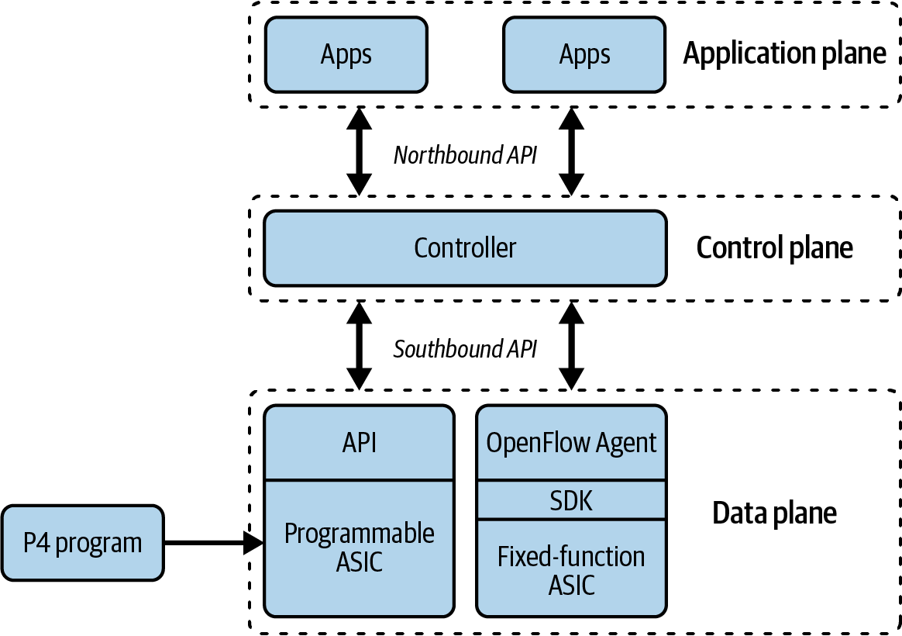

# CHAPTER 3 Linux

Цель этой главы - помочь вам познакомиться с основами Linux, операционной системы, которая становится все более распространенной в сетевых кругах. Вы можете удивиться, почему мы включили в эту книгу главу о Linux. В конце концов, какое отношение Linux, Unix-подобная операционная система, имеет к автоматизации и программированию сетей?

## Изучение Linux в контексте автоматизации сети

Рассматривая Linux с точки зрения сетевой автоматизации, мы считаем этот материал важным по нескольким причинам.

Во-первых, несколько современных сетевых операционных систем (NOS) основаны на Linux, хотя некоторые из них используют пользовательский CLI, а это означает, что они не выглядят и не действуют как Linux. Другие, однако, раскрывают внутреннее устройство Linux и/или используют оболочку Linux, такую как bash.

Во-вторых, некоторые новые компании и организации выпускают на рынок полноценные дистрибутивы Linux, ориентированные на сетевое оборудование. Например, проект OpenCompute Project (OCP) использует Open Network Linux (ONL) в качестве базы, на которой строятся NOS на базе Linux (компания Big Switch, ныне входящая в состав Arista, построила Switch Light на базе ONL, а проект DENT также построил dentOS на ONL). Cumulus Networks (теперь часть NVIDIA) - еще один пример, предлагающий свой Cumulus Linux на базе Debian в качестве NOS для поддерживаемых аппаратных платформ. SONiC - акроним, расшифровывающийся как Software for Open Networking in the Cloud - еще один пример, поддерживаемый такими организациями, как Microsoft, Intel, NVIDIA, Broadcom, Dell и другими. Как сетевому инженеру, вам все чаще придется знать Linux, чтобы настроить свою сеть.

И наконец, в-третьих, многие инструменты, о которых мы рассказываем в этой книге, берут свое начало в Linux или требуют, чтобы вы запускали их из Linux-системы. Например, Ansible (инструмент, который мы рассматриваем в главе 12) требует Python (тема, которую мы обсуждаем в главе 6).

По нескольким причинам, которые мы рассмотрим в главе 12, при автоматизации сетевого оборудования с помощью Ansible, вы обычно запускаете Ansible с подключенной к сети системы под управлением Linux, а не непосредственно на сетевом оборудовании. Аналогично, если вы используете Python для сбора и/или манипулирования данными с сетевого оборудования, вы часто будете делать это из системы под управлением Linux.

Наконец, относительно недавние разработки, такие как eBPF и XDP, увеличивают влияние Linux в сетевом мире в целом. Эти взаимосвязанные темы достаточно важны, чтобы заслужить свой собственный раздел в конце этой главы («Развитие ядра Linux с помощью eBPF и XDP»). В этом разделе мы дадим определение этим двум технологиям, объясним их важность и обсудим некоторые примеры использования. На данный момент достаточно сказать, что eBPF изменяет множество аспектов Linux, включая (но не ограничиваясь) сетевые возможности, безопасность и наблюдаемость.

По этим причинам мы считаем важным включить в книгу главу, которая призвана решить следующие задачи:

- Предоставить небольшую информацию об истории Linux

- Кратко объяснить концепцию дистрибутивов Linux

- Познакомить вас с bash, одной из самых популярных оболочек Linux.

- Обсудить основы работы с сетями Linux

- Погружение в некоторые продвинутые сетевые функции Linux

- Кратко рассмотрим сценарии bash для автоматизации.

Помните, что эта глава не претендует на роль всеобъемлющего трактата по
Linux или оболочке bash; скорее, она предназначена для того, чтобы вы начали работать с Linux в контексте автоматизации и программирования сети. Поэтому давайте начнем обсуждение Linux с краткого обзора его истории и происхождения.

## Краткая история Linux

История Linux состоит из нескольких нитей.

Одна из них началась в начале 1980-х годов, когда Ричард Столлман запустил проект GNU как попытку создать свободную Unix-подобную операционную систему. GNU, кстати, расшифровывается как GNU's Not Unix - рекурсивный акроним, который Столлман придумал для описания свободной Unix-подобной ОС, которую он пытался создать. Из усилий Столлмана в рамках проекта GNU появилась Стандартная общественная лицензия GNU (GPL). Хотя проект GNU смог создать бесплатные версии широкого набора утилит и приложений Unix, ядро - известное как GNU Hurd - для новой ОС проекта GNU так и не получило распространения.

Вторую нить можно найти в попытках Линуса Торвальдса создать клон MINIX в 1991 году, что послужило началом Linux. Из-за отсутствия свободного ядра ОС его первоначальная работа быстро получила поддержку и в 1992 году была лицензирована под GNU GPL с выпуском версии 0.99. С тех пор написанное им ядро (названное Linux) является ядром ОС по умолчанию для коллекции программ, созданной в рамках проекта GNU.

Поскольку Linux изначально относился только к ядру ОС и нуждался в коллекции программ проекта GNU для создания полноценной операционной системы, некоторые люди предлагали называть полноценную ОС GNU/Linux, и некоторые организации до сих пор используют это обозначение (например, Debian). Однако, по большому счёту, большинство людей называют всю ОС просто Linux, поэтому в этой книге мы придерживаемся именно этого обозначения.

## Понимание дистрибутивов Linux

Как вы видели в предыдущем разделе, операционная система Linux состоит из
ядра Linux и большой коллекции инструментов с открытым исходным кодом, разработанных в основном в рамках проекта GNU. Объединение ядра и коллекции программ с открытым исходным кодом привело к созданию дистрибутивов Linux (также известных как Linux distros).

Дистрибутив - это сочетание ядра Linux и набора открытых утилит, приложений и программных пакетов с открытым исходным кодом, которые собраны вместе и распространяются вместе (отсюда и название дистрибутив). За всю историю существования Linux множество дистрибутивов поднимались и падали в популярности (кто-нибудь помнит Slackware?), но на данный момент существует две основные ветви дистрибутивов Linux: ветвь Red Hat/CentOS и ветвь Debian и производных Debian.

### Red Hat Enterprise Linux, Fedora, CentOS, and Amazon Linux

Red Hat was an early Linux distributor that became a significant influencer and
commercial success in the Linux market, so it’s perfectly natural that one major
branch of Linux distributions is based on Red Hat.

Red Hat offers a commercial distribution, known as Red Hat Enterprise Linux
(RHEL), in addition to offering technical support contracts for RHEL. Many organizations today use RHEL because it is backed by Red Hat, focuses on stability and reliability, offers comprehensive technical support options, and is widely supported by other software vendors.

However, the fast-moving pace of Linux development and the Linux open source
community is often at odds with the slower and more methodical pace required to
maintain stability and reliability in the RHEL product. To help address this dichot‐
omy, Red Hat has an upstream distribution known as Fedora. We refer to Fedora as
an upstream distribution because much of the development of RHEL and RHEL-based
distributions occurs in Fedora, then flows “down” to these other products. In coordi‐
nation with the broader open source community, Fedora sees new kernel versions,
new kernel features, new package management tools, and other new developments first; these new things are tested and vetted in Fedora before being migrated to
the more enterprise-focused RHEL distribution at a later date. For this reason, you
may see Fedora used by developers and other individuals who need the “latest and
greatest,” but you won’t often see Fedora used in production environments.

Although RHEL and its variants are available only from Red Hat through a commer‐
cial arrangement, the open source license (the GNU GPL) under which Linux is
developed and distributed requires that the source of Red Hat’s distribution be made
publicly available. A group of individuals who wanted the stability and reliability
of RHEL but without the corresponding costs imposed by Red Hat took the RHEL
sources and created CentOS (which stands for Community Enterprise OS.) Originally,
CentOS was essentially a clone of RHEL, built from the same sources and freely
available without cost, but—like many open source software packages—it did not
come with any form of technical support.

In late 2020, the purpose of CentOS shifted away from being a RHEL clone and
into being a “midstream” distribution, sitting halfway between Fedora and RHEL.
This led to the rise of RHEL-compatible distributions branding themselves as CentOS
replacements, like AlmaLinux and Rocky Linux. For many organizations and many
use cases, the support available from the open source community is sufficient, so
it’s common to see these RHEL-compatible distributions used in a variety of environ‐
ments, including enterprise environments.

In September 2011, AWS introduced its own Linux distribution named Amazon
Linux, optimized for AWS and built to be largely compatible with RHEL. Amazon
Linux was replaced by Amazon Linux 2 in 2018. The successor to Amazon Linux 2,
named Amazon Linux 2022, was announced in preview in late 2021. At the time of
this writing, it had not yet been released for general availability. Amazon Linux 2022
is largely based on Fedora, but also incorporates components from CentOS Stream
and the RHEL sources.

One aspect shared by all these distributions (RHEL, Fedora, CentOS/RHEL clones,
and Amazon Linux) is a common package format. When Linux distributions first
started emerging, one key challenge that had to be addressed was the way in which
software was packaged with the Linux kernel. Because of the breadth of free software
available for Linux, shipping all of it in a distribution wasn’t really effective, nor
would users necessarily want all of the various pieces of software installed.

If not all of the software was installed, though, how would the Linux community
address dependencies? A dependency is a piece of software required to run another
piece of software on a computer. For example, some software might be written in
Python, which of course would require Python to be installed. Installing Python,
however, might require other pieces of software to be installed, and so on.

As an early distributor, Red Hat came up with a way to combine the files needed
to run a piece of software along with additional information about that software’s
dependencies into a single package—a package format. That package format is known
as an RPM, perhaps so named after the tool originally used to work with said pack‐
ages: RPM Manager (formerly Red Hat Package Manager), whose executable name
was simply rpm. All the Linux distributions we’ve discussed so far—RHEL, CentOS,
Fedora, and Amazon Linux—leverage RPM packages as their default package format,
although the specific tool used to work with these packages has evolved over time.

We mentioned that RPM originally referred to the actual package
manager itself, which was used to work with RPM packages. Most
RPM-based distributions have since replaced the rpm utility with
newer package managers that do a better job of understanding
dependencies, resolving conflicts, and installing (or removing)
software from a Linux installation. For example, RHEL/CentOS/
Fedora moved first to a tool called yum (short for Yellowdog
Updater, Modified) and are now migrating again to a tool called
dnf (which stands for Dandified YUM).

Other distributions also leverage the RPM package format, such as Oracle Linux,
Scientific Linux, and various SUSE Linux derivatives.

You might think that, because multiple Linux distributions all lev‐
erage the same package format (RPM), RPM packages are portable
across these Linux distributions. In theory, this is possible, but
in practice it rarely works. This is usually because of slight varia‐
tions in package names and package versions across the distribu‐
tions, which makes resolving dependencies and conflicts practically
impossible.

### Debian, Ubuntu, and Other Derivatives

Debian GNU/Linux is a distribution produced and maintained by the Debian Project.
The Debian Project was officially founded by Ian Murdock in 1993, and the creation
of Debian GNU/Linux was funded by the Free Software Foundation’s GNU Project
from November 1994 through November 1995. To this day, Debian remains the only
major distribution of Linux that is not backed by a commercial entity.

All Debian GNU/Linux releases since version 1.1 have used a code name taken from
a character in one of the Toy Story movies. Debian GNU/Linux 1.1, released in June
1996, was code-named Buzz. The most recent stable version of Debian GNU/Linux,
version 11.0, was released in August 2021 and is code-named Bullseye.

Debian GNU/Linux offers three branches: stable, testing, and unstable. The testing
and unstable branches are rolling releases that will, eventually, become the next stable branch. This approach results in a typically very high-quality release, and could be one of the reasons that other distributions are based on (derived from) Debian GNU/Linux.

One of the more well-known Debian derivatives is Ubuntu Linux, started in April
2004 and funded in large part by Canonical, a company founded by Mark Shuttle‐
worth. The first Ubuntu, released in October 2004 as version 4.10 (the “4” denotes
the year, and the “10” denotes the month of release), was code-named Warty War‐
thog. All Ubuntu codenames are composed of an adjective and an animal with the
same first letter (Warty Warthog, Hoary Hedgehog, Breezy Badger, etc.). Ubuntu was
initially targeted as a usable desktop Linux distribution, but now offers both desktop-,
server-, and mobile-focused versions.

Ubuntu uses time-based releases, releasing a new version every six months and a
long-term support (LTS) release every two years. LTS releases are supported by Can‐
onical and the Ubuntu community for a total of five years after release. All releases of
Ubuntu are based on packages taken from Debian’s unstable branch, which is why we
refer to Ubuntu as a Debian derivative.

Speaking of packages: like RPM-based distributions, the common thread across the
Debian and Debian derivatives—probably made clear by the term Debian derivatives
used to describe them—is that they share a common package format, known as the
Debian package format (and denoted by a .deb file extension). The founders of the
Debian Project created the DEB package format and the dpkg tool to solve the same
problems that Red Hat attempted to solve with the RPM package format. Also like
RPM-based distributions, Debian-based distributions evolved past the use of the dpkg
tool directly, first using a tool called dselect and then moving on to the use of the
apt tool (and programs like apt-get and aptitude).

Just as with RPM packages, the fact that multiple distributions lev‐
erage the Debian package format doesn’t mean that Debian pack‐
ages are necessarily portable among distributions. Slight variations
in package names, package versions, filepaths, and other details will
typically make portability difficult, if not impossible.

A key feature of the apt-based tools is the ability to retrieve packages from one or more remote repositories, which are online storehouses of Debian packages. The apt tools also feature dependency determination, conflict resolution, and package installation (or removal).

### Другие дистрибутивы Linux

Хотя на рынке существуют и другие дистрибутивы, эти две ветви - Red
Hat/Fedora/CentOS/clones/Amazon Linux и Debian/Ubuntu охватывают большинство экземпляров Linux, используемых сегодня в организациях. По этой причине мы сосредоточимся только на этих двух ветвях во всей остальной части этой главы. (В частности, мы будем использовать Debian, Amazon Linux, AlmaLinux и Ubuntu.) Если вы используете дистрибутив не из этих двух основных ветвей - возможно, вы работаете с SUSE Enterprise Linux, например, - имейте в виду, что между информацией, содержащейся здесь, и вашим конкретным дистрибутивом могут быть небольшие различия. За подробностями следует обращаться к документации вашего дистрибутива.

Теперь, когда мы представили обзор истории Linux и дистрибутивов Linux, давайте перейдем к взаимодействию с Linux, в первую очередь с помощью оболочки.

## Interacting with Linux

As a popular server OS, Linux can be used in a variety of ways across the network.
For example, you could receive IP addresses via a Linux-based Dynamic Host Con‐
figuration Protocol (DHCP) server, access a Linux-powered web server running the
Apache HTTP server or NGINX, or utilize a Domain Name System (DNS) server
running Linux in order to resolve domain names to IP addresses. There are, of
course, many more examples; these are just a few. In the context of our discussion of
Linux, though, we’re going to focus primarily on interacting with Linux via the shell.

The shell provides the CLI used by most users to interact with a Linux system. Linux
offers several shells, but the most common shell is bash, the Bourne Again Shell (a
play on the name of one of the original Unix shells, the Bourne Shell). In the vast
majority of cases, unless you’ve specifically configured your system to use a different
shell, you’re using bash when you’re interacting with Linux.

In this section, we’re going to provide you with enough basic information to get
started interacting with a Linux system’s console, and we’ll assume that you’re using
bash as your shell. If you are using a different shell, keep in mind that some of the
commands and behaviors we describe might be slightly different.

An entire book could be written about bash. In fact, one already
has—and is now in its third edition. If you want to learn more
about bash than we have room to talk about here, we highly recom‐
mend Learning the bash Shell, third edition, by Cameron Newham
and Bill Rosenblatt (O’Reilly).


We’ve broken our discussion of interacting with Linux into four major areas:

• Navigating the filesystem

• Manipulating files and directories

• Running programs

• Working with background services, known as daemons

This section is primarily targeting users who are new to Linux (a
lot of network engineers and IT professionals are mostly familiar
with Microsoft Windows). If you’re familiar with Linux, feel free to
skip ahead.

Let’s start with navigating the filesystem.

### Navigating the Filesystem

Linux uses a single-root filesystem: all the drives, directories, and files in a Linux
installation fall into a single namespace, referred to quite simply as /. (When you see /
by itself, say “root” in your head.) This is in stark contrast to an OS like Microsoft
Windows, where each drive typically has its own root (the drive letter, like C:\ or D:\).
Note that it is possible to mount a drive in a folder under Windows, but the practice
isn’t as common.

Linux follows in Unix’s footsteps in treating everything like a file.
This includes storage devices (which are treated as block devices),
ports on the computer (like serial ports), or even I/O devices. Thus,
the importance of a single-root filesystem—which encompasses
devices as well as storage—becomes even greater.

Like most other OSs, Linux uses directories (known as folders in some other OSs) to
group files in the filesystem. Every file resides in a directory, and therefore every file
has a unique path to its location. To denote the path of a file, you start at the root
and list all the directories it takes to get to that file, separating the directories with a
forward slash. For example, the command ping is often found in the bin directory
inside the usr directory off the root directory. The path, therefore, to ping would be
noted like this: /usr/bin/ping.

In other words, start at the root directory (/), enter the usr/ directory, continue into
the bin/ directory, and find the file named ping. Similarly, on Debian Linux 11, the ip
utility (which is a replacement for many older utilities like arp, ifconfig, iwconfig,
and route) is found at (in other words, its path is) /usr/bin/ip.

This concept of a path becomes important when we start considering that bash allows
you to navigate, or move around, within the filesystem. The prompt, or the text that
bash displays when waiting for you to input a command, will indicate your location
in the filesystem. Here’s the default prompt for Debian 11 running on an Amazon
Elastic Compute Cloud (EC2) instance (a cloud computing service we discuss in
much more detail in Chapter 4):

admin@ip-172-31-26-181:~$

Do you see it? Unless you’re familiar with Linux, you may have missed the tilde
(~) following admin@ip-172-31-26-181: in this example prompt. In the bash shell,
the tilde is a shortcut that refers to the user’s home directory. Each user has a home
directory that is their personal location for storing files, programs, and other content
for only that user. To make it easy to refer to one’s home directory, bash uses the tilde
as a shortcut. So, looking back at the sample prompt, you can see that this particular
prompt tells you a few facts:

1. The first part of the prompt, before the @ symbol, tells you the current user (in
1.

this case, admin).

2. The second part of the prompt, directly after the @ symbol, tells you the current
2.

hostname of the system on which you are currently operating (in this case,
ip-172-31-26-181 is the automatically generated hostname provided by AWS).

3. Following the colon is the current directory, noted in this case as ~, meaning that
3.

this user (admin) is currently in their home directory.

4. Finally, even the $ at the end has meaning—in this particular case, it means that
4.

the current user (admin) does not have root permissions. The $ will change to
a hash sign (the # character, also known as an octothorpe) if the user has root
permissions. This is analogous to the way that the prompt for a network device,
such as a router or switch, may change depending on the user’s privilege level.

The default prompt on an Amazon Linux 2 system looks like this:

[ec2-user@ip-172-31-5-69 ~]$

As you can see, it’s similar, and it conveys the same information as the preceding
example prompt, albeit in a slightly different format. Like the earlier example, this
prompt shows us the current user (ec2-user), the hostname of the current system
(ip-172-31-5-69), the current directory (~), and the effective permissions of the
logged-in user ($).

Throughout this chapter, you’ll see various Linux prompts similar
to ones we just showed you. As we mentioned earlier, we’re using
four Linux distributions in this chapter: Debian 11, Amazon Linux
2, AlmaLinux 9, and Ubuntu 20.04. For the first part of the chapter,
we’ll be running these on AWS, which means normally the prompts
would look similar to what we’ve shown you so far. Later, we’ll
be running them as VMs on a hypervisor on our local network.
Regardless, we’ve taken the liberty of customizing these prompts
to show the username and a user-friendly distribution name. Keep
in mind that the appearance of the prompt on your own Linux
systems may look different depending on where and how you are
running them.

The use of the tilde is helpful in keeping the prompt short when you’re in your home
directory, but what if you don’t know the path to your home directory? In other
words, what if you don’t know where on the system your home directory is located?
When you need to determine the full path to your current location, bash offers the
pwd (print working directory) command, which produces output something like this:

admin@debian11:~$ pwd
/home/admin

The pwd command simply returns the directory where you’re currently located in the
filesystem (the working directory).

Now that you know where you are located in the filesystem, you can begin to move
around the filesystem by using the cd (change directory) command along with a
path to a destination. For example, if you were in your home directory and wanted
to change into the bin subdirectory, you’d simply type cd bin and press Enter (or
Return).

Note the lack of the leading slash here. This is because /bin and bin might indicate two
very different locations in the filesystem:

• Using bin (no leading slash) tells bash to change into the bin subdirectory of the
•

current working directory.

• Using /bin (with a leading slash) tells bash to change into the bin subdirectory of
•

the root (/) directory.

See how, therefore, bin and /bin might indicate very different locations? This is
why understanding the concept of a single-root filesystem and the path to a file
or directory is important. Otherwise, you might end up performing an action on a
different file or directory than you intended! This is particularly important when it
comes to manipulating files and directories, which we discuss in the next section.

Before moving on, though, we need to discuss a few more navigational commands.

To move up one level in the filesystem (for example, to move from /usr/local/bin/
to /usr/local/), you can use the .. shortcut. Every directory contains a special entry,
named .. (two periods), that is a shortcut entry for that directory’s parent directory
(the directory one level above it). So, if your current working directory is /usr/local/
bin, you can simply type cd .. and press Enter (or Return) to move up one directory:

admin@debian11:/usr/local/bin$ cd ..
admin@debian11:/usr/local$

You can combine the .. shortcut with a directory name to move laterally between
directories. For example, if you’re currently in /usr/local and need to move to /usr/
share, you can type cd ../share and press Enter. This moves you to the directory
whose path is up one level (..) and is named share:

admin@debian11:/usr/local$ cd ../share
admin@debian11:/usr/share$

You can also combine multiple levels of the .. shortcut to move up more than one
level. For example, if you are currently in /usr/share and need to move to / (the root
directory), you could type cd ../../ and press Enter. This would put you into the
root directory:

admin@debian11:/usr/share$ cd ../..
admin@debian11:/$

All these examples are using relative paths—paths that are relative to your current
location. You can, of course, also use absolute paths—paths that are anchored to the
root directory. As we mentioned earlier, the distinction is the use of the forward slash
(/) to denote an absolute path starting at the root versus a path relative to the current
location.

For example, if you are currently located in the root directory (/) and need to move
to /media/cdrom, you don’t need the leading slash (because media is a subdirectory
of /). You can type cd media/cdrom and press Enter. This will move you to /media/
cdrom because you used a relative path to your destination:

admin@debian11:/$ cd media/cdrom
admin@debian11:/media/cdrom$

From here, though, if you needed to move to /usr/local/bin, you’d want to use an
absolute path. Why? Because there is no (easy) relative path between these two loca‐
tions that doesn’t involve moving through the root. Using an absolute path, anchored
with the leading slash, is the quickest and easiest approach:

admin@debian11:/media/cdrom$ cd /usr/local/bin
admin@debian11:/usr/local/bin$

If you’re thinking that you could have also used the command
cd ../../usr/local/bin to move from /media/cdrom to /usr/
local/bin, you’ve mastered the relationship between relative paths
and absolute paths on a Linux system.

Finally, we want to share one final navigation trick. Suppose you’re in /usr/local/
bin, but you need to switch over to /media/cdrom. So you enter cd /media/cdrom,
but after switching directories realize you needed to be in /usr/local/bin after all.
Fortunately, you can use a quick fix. The notation cd - (using a hyphen after the
cd command) tells bash to switch back to the last directory you were in before you
switched to the current directory. (If you need a shortcut to get back to your home
directory, just enter cd with no parameters.) Here’s an example:

admin@debian11:/usr/local/bin$ cd /media/cdrom
admin@debian11:/media/cdrom$ cd -
/usr/local/bin
admin@debian11:/usr/local/bin$ cd -
/media/cdrom
admin@debian11:/media/cdrom$ cd -
/usr/local/bin
admin@debian11:/usr/local/bin$

Here are all of these filesystem navigation techniques in action:

admin@debian11:/usr/local/bin$ cd ..
admin@debian11:/usr/local$ cd ../share
admin@debian11:/usr/share$ cd ../..
admin@debian11:/$ cd media/cdrom
admin@debian11:/media/cdrom$ cd /usr/local/bin
admin@debian11:/usr/local/bin$ cd -
/media/cdrom
admin@debian11:/media/cdrom$ cd -
/usr/local/bin
admin@debian11:/usr/local/bin$

Now you should have a pretty good grasp on how to navigate around the Linux
filesystem. Let’s build on that knowledge with some information on manipulating
files and directories.

### Manipulating Files and Directories

Armed with a basic understanding of the Linux filesystem, paths within the filesystem, and how to move around the filesystem, let’s take a quick look at manipulating files and directories. We’ll cover four basic tasks:

* Creating files and directories
* Deleting files and directories
* Moving, copying, and renaming files and directories
* Changing permissions

Let’s start with creating files and directories.

Creating files and directories

To create files or directories, you’ll work with one of two basic commands: touch,
which is used to create files, and mkdir (make directory), which is used—not surprisingly—to create directories.

You can create files in other ways, such as echoing command out‐
put to a file or using an application (like a text editor, for example).
Rather than trying to cover all the possible ways to do something,
we want to focus on getting you enough information to get started.

The touch command creates a new file with no content (it’s up to you to use a text
editor or appropriate application to add content to the file after it is created). Let’s
look at a few examples:

[ec2-user@amazonlinux2 ~]$ touch config.txt

Here’s an equivalent command:

[ec2-user@amazonlinux2 ~]$ touch ./config.txt

The reason this command is equivalent to the earlier example may not be immedi‐
ately obvious. In the previous section, we talked about the .. shortcut for moving to
the parent directory of the current directory. Every directory also has an entry noted
by a single period (.) that refers to the current directory. Therefore, the commands
touch config.txt and touch ./config.txt will both create a file named config.txt
in the current working directory.

If both syntaxes are correct, why are there two ways of doing it? In this case, both
commands produce the same result—but this isn’t the case for all commands. When
you want to be sure that the file you’re referencing is the file in the current working
directory, use ./ to tell bash you want the file in the current directory:

[ec2-user@amazonlinux2 ~]$ touch /config.txt

In this case, we’re using an absolute path, so this command creates a file named
config.txt in the root directory, assuming your user account has permission. (We talk
about permissions in “Changing permissions” on page 58.)

We haven’t discussed in detail yet bash’s search paths, which are
paths (locations) in the filesystem that bash will automatically
search when you type in a command. In a typical configuration,
paths such as /usr/bin, /usr/sbin, and similar locations are included
in the search path. Thus, if you specify a filename from a file in one
of those directories without using the full path, bash will find it for
you by searching these paths. This is one of the times when being
specific about a file’s location (by including ./ or the absolute path)
might be a good idea, so that you can be sure which file is the one
being found and used by bash.

The mkdir command is simple: it creates the directory specified by the user. Let’s look
at a quick example:

[ec2-user@amazonlinux2 ~]$ mkdir bin

This command creates a directory named bin in the current working directory. It’s
different from this command (relative versus absolute paths!):

[ec2-user@amazonlinux2 ~]$ mkdir /bin

Like most other Linux commands, mkdir has a lot of options that modify its behavior,
but one you’ll use frequently is the -p parameter. When used with -p, mkdir will not
report an error if the directory already exists, and will create parent directories along the path as needed.

For example, let’s say you have some files you need to store, and you want to store
them in /opt/sw/network. If you are in the /opt directory and enter mkdir sw/network
and the sw directory doesn’t already exist, the mkdir command will report an error.
However, if you simply add the -p option, mkdir will create the sw directory if
needed, and then create network under sw. This is a great way to create an entire path
all at once without failing because of errors if a directory along the way already exists.

Creating files and directories is half of the picture; let’s look at the other half (deleting
files and directories).

#### Deleting files and directories

Just as Linux has two commands for creating files and directories, it has two commands for deleting files and directories. Generally, you’ll use the rm command to
delete (remove) files, and you’ll use the rmdir command to delete directories. You can
also use rm to delete directories, as we’ll show you in this section.

To remove a file, you simply use rm filename. For example, to remove a file named
config.txt in the current working directory, you’d use one of the two following com‐
mands (do you understand why?):

ubuntu@ubuntu2004:~$ rm config.txt
ubuntu@ubuntu2004:~$ rm ./config.txt

You can, of course, use absolute paths (/home/ubuntu/config.txt) as well as relative
paths (./config.txt).

To remove a directory, you use rmdir directory. Note, however, that the directory
has to be empty; if you attempt to delete a directory containing files, you’ll get this
error message:

rmdir: failed to remove 'src': Directory not empty

In this case, you’ll need to first empty the directory, then use rmdir. Alternately, you
can use the -r parameter to the rm command. Normally, if you try to use the rm
command on a directory but fail to use the -r parameter, bash will respond like this
(in this example, we tried to remove a directory named bin in the current working
directory):

rm: cannot remove 'bin': Is a directory

When you use rm -r directory, though, bash will remove the entire directory tree.
Note that, by default, rm isn’t going to prompt for confirmation; it’s simply going to
delete the whole directory tree. No Recycle Bin, no Trash Can—it’s gone. (If you want
a prompt, you can add the -i parameter.)

The mv and cp commands that we discuss in the next section also
will simply overwrite files in the destination without any prompt,
unless you use the -i parameter. Be sure to exercise the appropriate
level of caution when using these commands.

Creating and deleting files and directories aren’t the only tasks you might need to do,
though, so let’s take a quick look at moving (or copying) files and directories.

#### Moving, copying, and renaming files and directories

When it comes to moving, copying, and renaming files and directories, the two
commands you’ll need to use are cp (for copying files or directories) and mv (for
moving and renaming files and directories).

The basic use of all the Linux commands we’ve shown you so far is
relatively easy to understand, but—as the saying goes—the devil is
in the details. If you need more information on any of the options,
parameters, or the advanced usage of just about any command
in Linux, use the man (manual) command. For example, to view
the manual page for the cp command, type man cp. The manual
pages show a more detailed explanation of how to use the various
commands.

To copy a file, it’s just cp source destination. Similarly, to move a file, you would
use mv source destination. Renaming a file, by the way, is considered moving it
from one name to a new name (typically in the same directory).

Moving a directory is much the same; use mv source-dir destination-dir. This is
true whether the directory is flat (containing only files) or a tree (containing both files
as well as subdirectories).

Copying directories is only a bit more complicated. Just add the -r option, like
cp -r source-dir destination-dir. This will handle most use cases for copying
directories, although some less common use cases may require additional options.
We recommend you read and refer to the man (manual) page for cp for additional
details (see the preceding tip).

The final topic we’d like to tackle in our discussion of manipulating files and directo‐
ries is permissions.

#### Changing permissions

Taking a cue from its Unix predecessors (keeping in mind that Linux rose out of
efforts to create a free Unix-like operating system), Linux is a multiuser OS that
incorporates the use of permissions on files and directories. To be considered a
multiuser OS, Linux had to have a way to make sure one user couldn’t view/see/
modify/remove other users’ files, and so file- and directory-level permissions were a
necessity.

Linux permissions are built around a couple of key ideas:

• Permissions are assigned based on the user (the user who owns the file), group
•

(other users in the file’s group), and others (other users not in the file’s group).

• Permissions are based on the action (read, write, and execute).
•

Here’s how these two ideas come together. Each action (read, write, and execute) is
assigned a value; specifically, read is set to 4, write is set to 2, and execute is set to
1. (Note that these values correspond exactly to binary values.) To allow multiple
actions, add the values for each underlying action. For example, if you want to allow
both read and write, the value you assign is 6 (read = 4, write = 2, so read + write = 6).

These values are then assigned to user, group, and others. For example, to allow the
file’s owner to read and write to a file, you assign the value 6 to the user’s permissions.
To allow the file’s owner to read, write, and execute a file, you assign the value 7 to the
user’s permissions.

Similarly, if you want to allow users in the file’s group to read the file but not write or
execute it, you assign the value 4 to the group’s permissions. User, group, and other
permissions are listed as an octal number, like this:

644 (user = read + write, group = read, others = read)
755 (user = read + write + execute, group = read + execute,
others = read + execute)
600 (user = read + write, group = none, others = none)
620 (user = read + write, group = write, others = none)

You may also see these permissions listed as a string of characters, like rwxr-xr-x.
This indicates the read (r), write (w), and execute (x) permissions for each of the three
entities (user, group, and others). Here are the same examples as earlier, but written in
alternate format:

644 = rw-r--r--
755 = rwxr-xr-x
600 = rw-------
620 = rw--w----

The read and write permissions are self-explanatory, but execute is a bit different.
For a file, it means just what it says: the ability to execute the file as a program
(something we discuss in more detail in “Running Programs” on page 61). For
a directory, though, it means the ability to look into and list the contents of the
directory. Therefore, if you want members of a directory’s group to see the contents
of that directory, you need to grant the execute permission.

A couple of Linux tools are used to view and modify permissions. The ls utility, used
for listing the contents of a directory, will show permissions when used with the -l
option and is most likely the primary tool you’ll use to view permissions. Figure 3-1
contains the output of ls -l /usr/bin on a Debian 11 system and clearly shows
permissions assigned to the files in the listing.



Figure 3-1. Permissions in a file listing

To change or modify permissions, you need to use the chmod utility. This is where the
explanation of octal values (755, 600, 644, etc.) and the rwxr-xr-x notation (typically
referred to as symbolic notation) comes in handy, because that’s how chmod expects
the user to enter permissions. As with relative paths versus absolute paths, the use
of octal values versus symbolic notation is really a matter of what you’re trying to
accomplish:

• If you need (or are willing) to set all the permissions at the same time, use
•

octal values. Even if you omit some of the digits, you’ll still be changing the
permissions because chmod assumes missing digits are leading zeros (and thus
you’re setting permissions to none).

• If you need to set only one part (user, group, or others) of the permissions while
•

leaving the rest intact, use symbolic notation. This will allow you to modify only
one part of the permissions (for example, only the user permissions or only the
group permissions).

Here are a few quick examples of using chmod. First, let’s set the bin directory in
the current working directory to mode 755 (owner = read/write/execute, all others =
read/execute):

[ec2-user@amazonlinux2 ~]$ chmod 755 bin

Next, let’s use symbolic notation to add read/write permissions to the user who owns the file config.txt in the current working directory, while leaving all other permissions intact:

[ec2-user@amazonlinux2 ~]$ chmod u+rw config.txt

Here’s an even more complex example—this adds read/write permissions for the file
owner, but removes write permission for the file group:

[ec2-user@amazonlinux2 ~]$ chmod u+rw,g-w /opt/share/config.txt

The chmod command also supports the use of the -R option to act recursively, mean‐
ing the permission changes will be propagated to files and subdirectories (obviously,
this works only when you’re using chmod against a directory).

Given that file ownership and file group play an integral role in file
permissions, it’s natural that Linux also provides tools to modify
file ownership and file group (the ls command is used to view
ownership and group, as shown earlier in Figure 3-1). You’ll use the
chown command to change ownership and the chgrp command to
change the file group. Both commands support the same -R option
as chmod to act recursively.

We’re now ready to move on from file and directory manipulation to our next major
topic in interacting with Linux, which is running programs.

### Running Programs

Running programs is pretty simple, given the material we’ve already covered. To run a
program, here’s what’s needed:

• A file that is executable (you can use the file utility to help determine whether a file is executable)

• Execute permissions (either as the file owner, as a member of the file’s group, or with the execute permission given to others)

We discussed the second requirement (execute permissions) in the previous section on permissions, so we don’t need to cover that again here. If you don’t have execute permissions on the file, use the chmod, chown, and/or chgrp commands as needed to address it. The first requirement (an executable file) deserves a bit more discussion, though.

What makes up an executable file? It could be a binary file, compiled from a pro‐
gramming language such C or C++. However, it could also be an executable text file,
such as a bash shell script (a series of bash shell commands) or a script written in a
language like Python or Ruby. (We cover Python extensively in Chapter 6.) The file utility can help here (file may or may not be installed by default; use your Linux
distribution’s package management tool to install it if it isn’t already installed).

Here’s the output of the file command against various types of executable files:

admin@debian11:~$ file /bin/bash
/bin/bash: ELF 64-bit LSB executable, x86-64, version 1 (SYSV), dynamically
linked, interpreter /lib64/ld-linux-x86-64.so.2, BuildID[sha1]=3313b4cb119dcce
16927a9b6cc61dcd97dfc4d59, for GNU/Linux 3.2.0, stripped
admin@debian11:~$ file /usr/local/bin/kubectl
/usr/local/bin/kubectl: ELF 64-bit LSB executable, x86-64, version 1 (SYSV),
statically linked, Go BuildID=udvEuh-txVq1kB1pCAyG/K_fqce2JzNpLs4j8aaW9/fKnl1Z
SWXEi1VKww0UrK/rUvBWXXhKqBjdb_5dTXI, stripped
admin@debian11:~$ file shellscript.sh
script.sh: Bourne-Again shell script, ASCII text executable
admin@debian11:~$ file testscript.py
script.py: Python script, ASCII text executable
admin@debian11:~$ file testscript-2.rb
script.rb: Ruby script, ASCII text executable

The file command can identify text files as a Python script, a
Ruby script, or a shell (bash) script. This might sound like magic,
but in reality it’s relying upon a Linux construct known as the
shebang. This first line in a text-based script starts with the charac‐
ters #!, followed by the path to the interpreter to the script (the
interpreter executes the commands in the script). For example, on
a Debian 11 system, the Python interpreter is found at /usr/bin/
python3, and so the shebang for a Python script would look like
#!/usr/bin/python3. A Ruby script would have a similar shebang,
but pointing to the Ruby interpreter. A bash shell script’s shebang
would point to bash itself, of course.

Once you’ve satisfied both requirements—you have an executable file and you have
execute permissions on the executable file—running a program is as simple as enter‐
ing the program name on the command line. That’s it. Each program may, of course,
have certain options and parameters that need to be supplied. The only real “gotcha”
here might be around the use of absolute paths; for example, if multiple programs
named testnet exist on your Linux system and you simply enter testnet at the shell
prompt, which one will it run? This is where an understanding of bash search paths
(which we discuss next) and/or the use of absolute paths can help ensure that you’re
running the intended program.

Let’s expand on this potential gotcha just a bit. In “Navigating the Filesystem” on page
50, we covered relative paths and absolute paths. We’re going to add to this discussion
by introducing the concept of a search path. Every Linux system has a search path,
which is a list of directories on the system that it will search when the user enters a filename. You can see the current search path by entering echo $PATH at your shell prompt, and on an Amazon Linux 2 system you’d see something like this:

[ec2-user@amazonlinux2 ~]$ echo $PATH
/usr/local/bin:/usr/bin:/usr/local/sbin:/usr/sbin:/home/ec2-user/.local/bin:
/home/ec2-user/bin

This means that if you have a script named testscript.py stored in /usr/local/bin, you
can be in any directory on the system and simply enter the script’s name (testscript.py)
to execute the script. The system will search the directories in the search path (in
order) for the filename you enter and execute the first one it finds (which, in this case,
will typically be the one in /usr/local/bin because that’s the first directory in the search
path).

You’ll note, by the way, that the search path does not include the current directory.
Let’s say you create a scripts directory in your home directory, and in that directory
you have a shell script you’ve written called shellscript.sh. Take a look at the behavior
from the following set of commands:

[ec2-user@amazonlinux2 ~]$ pwd
/home/ec2-user/scripts
[ec2-user@amazonlinux2 ~]$ ls
shellscript.sh
[ec2-user@amazonlinux2 ~]$ shellscript.sh
-bash: /home/ec2-user/bin/shellscript.sh: No such file or directory
[ec2-user@amazonlinux2 ~]$ ./shellscript.sh
This is a shell script.

Because the shell script isn’t in the search path, we have to use an absolute path—in
this case, the absolute path is telling bash (via the ./ notation) to look in the current
directory.

Therefore, the gotcha is that any program you run—be it a compiled binary or
an ASCII text script that will be interpreted by bash, Python, Ruby, or another
interpreter—needs to be in the search path, or you’ll have to explicitly specify the
absolute path (which may include the current directory) to the program. In the
case of multiple programs with the same name in different directories, the program
that bash finds first will be the program that gets executed, and the search order is
determined by the search path.

To help with this potential gotcha when you have multiple programs with the same
name, you can use the which command. For example, suppose you have a Python
script named uptime that gathers uptime statistics from your network devices. Most
Linux distributions also ship with a command called uptime (it displays information
about how long the Linux system has been up and running). By typing which
uptime, you can ask the Linux system to tell you the full path to the first uptime
executable it finds when searching the search path. (This is the one that will be executed if you just type uptime at the prompt.) Based on this information, you can either specify a full path to your Python script or modify the search path (if needed).

You can, of course, change and customize the search path. The
search path is controlled by an environment variable whose name
is PATH. (By convention, all environment variables are specified in
uppercase letters.) Modifying this environment variable will mod‐
ify the search order that bash uses to locate programs.

We’re going to cover one more topic before moving on to a discussion of networking
in Linux, and that’s working with background programs, also known as daemons.

### Working with Daemons

In the Linux world, we use the term daemon to refer to a process that runs in the background. (You may also see the term service used to describe these types of background processes.) Daemons are most often encountered when you’re using Linux to provide network-based functionality. Examples—some of which we discussed earlier when we first introduced interacting with Linux—might include a DHCP server, an HTTP server, a DNS server, or an FTP server. On a Linux system, each of these network services is provided by a corresponding daemon (or service). In this section, we cover how to work with daemons: start daemons, stop daemons, restart a daemon, or check on a daemon’s status.

It used to be that working with daemons on a Linux system varied pretty widely
among distributions. Startup scripts, referred to as init scripts, were used to start,
stop, or restart a daemon. Some distributions offered utilities—often nothing more
than bash shell scripts—such as the service command to help simplify working with
daemons. For example, on Ubuntu 14.04 LTS and CentOS 7.1 systems, the service
command (found in /usr/sbin) allowed you to start, stop, or restart a daemon. Behind
the scenes, these utilities are calling distribution-specific commands (such as initctl
on Ubuntu or systemctl on CentOS) to actually perform their actions.

In recent years, though, virtually all the major Linux distributions have converged on the use of systemd as their init system: RHEL/CentOS 7.x, Debian 8.0 and later, and Ubuntu 15.04 and later all use systemd. While this brings a great deal of consistency to working with daemons across different Linux distributions, keep in mind that slight variations may occur in the implementation of systemd among different distributions.

Prior to version 8.0, Debian did not use systemd. Instead, Debian
used an older init system known as System V init (or sysv-rc).
Similarly, Ubuntu 14.04 used a Canonical-developed system called
Upstart, but switched to systemd with the next major LTS release
(16.04).

There’s a great deal more to systemd than we have room to discuss here. When
we provide examples on how to start, stop, or restart a background service using
systemd, we assume that the systemd unit has already been installed and enabled, and
that it is recognized by systemd. We encourage you to review the man pages for the
systemd commands shared in this section for more details.

If you are interested in more details on systemd, we recommend
having a look at the systemd website.

Let’s start by looking at starting background services.

Starting, stopping, and restarting background services

For distributions using systemd as the init system, the primary means by which you’ll
work with background services is via the systemctl utility (found on the system
as /usr/bin/systemctl). Some distributions have “wrapper” scripts that call systemctl
on the backend, but we won’t discuss those here. Instead, we’ll show you how to work
with systemctl directly.

To start a daemon using systemd, you call systemctl with the start subcommand
(by the way, we’re using subcommand here to refer to the parameter supplied to
systemctl that provides the action it should take—we also use this nomenclature
later in this chapter when working with Linux networking):

admin@debian11:~$ systemctl start service-name

The service-name referenced in the preceding command is the name of a systemd
unit. If you don’t know the name of the service, systemctl offers the list-units
subcommand, which will give you a paged list of all the loaded and active units.

To stop a daemon using systemd, replace the start subcommand with stop, like this:

[ec2-user@amazonlinux2]:~$ systemctl stop service-name

Similarly, use the restart subcommand to stop and then start a daemon:

ubuntu@ubuntu2004:~$ systemctl restart service-name

Note that systemctl also supports a reload subcommand, which will cause a dae‐
mon to reload its configuration. This may be less disruptive than restarting a daemon
(via systemctl restart, which will almost always be disruptive), but the exact way
a daemon will respond to reloading its configuration will vary (in other words, not
all daemons will apply the new configuration automatically or behave in the same
fashion).

Checking the status or configuration of a background service

In addition to starting, stopping, and restarting daemons, systemctl offers other
functionality to help manage background services. For example, you can use the sta
tus subcommand to systemctl to check the current status of a daemon. Figure 3-2
shows the output of running systemctl status.


*Figure 3-2. Output of the systemctl status command*

We’ve mentioned the idea of a systemd unit a couple of times so far; a systemd unit can be considered any resource that systemd knows how to operate and/or manage.
Systemd knows how to operate or manage resources via configuration files known
as unit files. While a full explanation of systemd unit files is beyond the scope of
this book, you can use systemctl to show you a unit’s configuration file via the
systemctl cat command, as shown in Figure 3-3.


Figure 3-3. Output of the systemctl cat command

To change the configuration of a systemd unit, you need to perform a daemon reload
of systemctl so that it reads in the new configuration:

[ec2-user@amazonlinux2 ~]$ systemctl daemon-reload

Before we wrap up this section on working with daemons and move into a discussion
of Linux networking, let’s explore a few final commands you might find helpful.

Other daemon-related commands

When working with daemons, you might find a few other commands useful. For full
details on all the various parameters for these commands, we encourage you to read
the man pages (use man command at a bash prompt):

* To show network connections to a daemon, you can use ss. One particularly helpful use of this command is to show listening network sockets, which is
one way to ensure that the networking configuration for a particular daemon
(background service) is working properly. Use ss -lnt to show listening TCP
sockets, and use ss -lnu to show listening UDP sockets. Note that this syntax
replaces the use of the now-deprecated netstat command.

* The ps command is useful for presenting information on the currently running processes.

Before we move on to the next section, let’s take a quick moment and review what
we’ve covered so far:

* Background and history for Linux
* Basic filesystem navigation and paths
* Basic file manipulations (creating files and directories, moving/copying files and directories, and removing files and directories)
* Background services, also known as daemons

Our next major topic is networking in Linux, which will build on many of the areas
we’ve already touched on so far in this chapter.

## Networking in Linux

We’ve stated that this chapter is intended to get you up and running with Linux in
the context of network automation and programmability. You’ll likely be using tools like Python, Ansible, or Jinja (covered in Chapters 6, 12, and 9, respectively) on Linux, and your Linux system is going to need to communicate across the network to various devices. Naturally, therefore, our discussion of Linux would not be complete without also discussing networking in Linux. This is, after all, a networking-centric book!

Because networking in public cloud environments can, at times,
work a bit differently than typical on-premises networks, in this
section we’ll be using Linux running in VMs on a local hypervisor.
As a result, we’re switching out Amazon Linux 2 for AlmaLinux
9. AlmaLinux 9 is one of several successors to CentOS after the
transition to CentOS Stream, and describes itself as 1:1 binary
compatible with RHEL.

### Working with Interfaces

The basic building block of Linux networking is the interface. Linux supports several
types of interfaces; the most common are physical interfaces, VLAN interfaces, and
bridge interfaces. As with most other things in Linux, you configure these various
types of interfaces by executing command-line utilities from the bash shell or using
certain plain-text configuration files. Making interface configuration changes persis‐
tent across a reboot typically requires modifying a configuration file. Let’s look first
at using the command-line utilities, and then we’ll discuss persistent changes using
interface configuration files.


#### Interface configuration via the command line

Just as the Linux distributions have converged on systemd as the primary init system,
most of the major Linux distributions have converged on a single set of command-
line utilities for working with network interfaces. These commands are part of the
iproute2 set of utilities, available in the major Linux distributions as either iproute
or iproute2. This set of utilities uses the ip command to replace the functionality of
earlier (and now deprecated) commands such as ifconfig and route.

If you’re interested in more information on iproute2, visit the
“iproute2” Wikipedia page.

For interface configuration, two subcommands to the ip command will be used: ip
link, to view or set interface link status, and ip addr, to view or set IP addressing
configuration on interfaces. (We present other forms of the ip command later in this
section.)

Let’s look at a few task-oriented examples of using the ip commands to perform
interface configuration.

Listing interfaces.    You can use either ip link or ip addr to list all the interfaces on a
system, although the output will be slightly different for each command.

If you want a listing of the interfaces along with the interface status, use ip link
list, like this:

[almalinux@alma9 ~]$ ip link list
1: lo: <LOOPBACK,UP,LOWER_UP> mtu 65536 qdisc noqueue state UNKNOWN mode DEFAULT
 group default qlen 1000
    link/loopback 00:00:00:00:00:00 brd 00:00:00:00:00:00
2: eth0: <BROADCAST,MULTICAST,UP,LOWER_UP> mtu 1500 qdisc fq_codel state UP mode
 DEFAULT group default qlen 1000
    link/ether 52:54:00:d2:c5:f4 brd ff:ff:ff:ff:ff:ff
    altname enp0s3
    altname ens3

The default action, so to speak, for most (if not all) of the ip
commands is to list the items with which you’re working. Thus, if
you want to list all the interfaces, you can just use ip link instead
of ip link list, or if you want to list all the routes, you can
just use ip route instead of ip route list. We specify the full
commands here for clarity.


As you can tell from the prompt, this output was taken from an AlmaLinux 9
VM (which, as we described earlier in this section, is considered to be 1:1 binary compatible with RHEL). The command syntax is the same across the three major distributions we’re discussing in this chapter, and the output is largely identical (with the exception of interface names).

This output shows you the current list of interfaces (throughout this section, note
that the different Linux distributions may use different naming conventions for
network interfaces), the current MTU, the current administrative state (UP), and the
ethernet MAC address, among other things.

The output of this command also tells you the current state of the interface (note the
information in angle brackets immediately following the interface name):

UP
The interface is enabled.

LOWER_UP
The interface link is up.

NO_CARRIER (not shown)
The interface is enabled, but there is no link.

If you’re accustomed to working with network equipment, you’re probably familiar
with an interface being “down” versus being “administratively down.” If an interface is
down because there is no link, you’ll see NO_CARRIER in the brackets immediately after
the interface name; if the interface is administratively down, then you won’t see UP,
LOWER_UP, or NO_CARRIER, and the state will be listed as DOWN. In the next section, we’ll
show you how to use the ip link command to disable an interface (set an interface
as administratively down).

You can also list interfaces by using the ip addr list command, like this (this
output is taken from Ubuntu 20.04 LTS):

```
ubuntu@ubuntu2004:~$ ip addr list
1: lo: <LOOPBACK,UP,LOWER_UP> mtu 65536 qdisc noqueue state UNKNOWN group default
qlen 1000
    link/loopback 00:00:00:00:00:00 brd 00:00:00:00:00:00
    inet 127.0.0.1/8 scope host lo
       valid_lft forever preferred_lft forever
    inet6 ::1/128 scope host
       valid_lft forever preferred_lft forever
2: ens3: <BROADCAST,MULTICAST,UP,LOWER_UP> mtu 1500 qdisc fq_codel state UP group
default qlen 1000
    link/ether 52:54:00:8d:04:a3 brd ff:ff:ff:ff:ff:ff
    inet 192.168.122.215/24 brd 192.168.122.255 scope global dynamic ens3
       valid_lft 2581sec preferred_lft 2581sec
    inet6 fe80::5054:ff:fe8d:4a3/64 scope link
       valid_lft forever preferred_lft forever
```


As you can see, ip addr list also lists the interfaces on the system, along with some
link status information and the IPv4/IPv6 addresses assigned to the interface.

For both ip link list and ip addr list, you can filter the list to only a specific
interface by adding the interface name. The final command then becomes ip link
list interface or ip addr list interface, like this:

```
debian@debian11:~$ ip addr list ens5
2: ens3: <BROADCAST,MULTICAST,UP,LOWER_UP> mtu 1500 qdisc pfifo_fast state UP
group default qlen 1000
    link/ether 52:54:00:7d:2b:d1 brd ff:ff:ff:ff:ff:ff
    altname enp0s3
    inet 192.168.122.104/24 brd 192.168.122.255 scope global dynamic ens3
       valid_lft 2856sec preferred_lft 2856sec
    inet6 fe80::5054:ff:fe7d:2bd1/64 scope link
       valid_lft forever preferred_lft forever
```

Listing interfaces is useful, of course, but perhaps even more useful is actually modi‐
fying the configuration of an interface. In the next section, we’ll show you how to
enable or disable an interface.

Enabling/disabling an interface.    In addition to listing interfaces, you also use the ip
link command to manage an interface’s status. To disable an interface, for example,
you set the interface’s status to down by using the ip link set command:

[almalinux@alma9 ~]$ ip link set eth0 down
[almalinux@alma9 ~]$ ip link list eth0
2: eth0: <BROADCAST,MULTICAST> mtu 1500 qdisc fq_codel state DOWN mode DEFAULT
group default qlen 1000
    link/ether 52:54:00:d2:c5:f4 brd ff:ff:ff:ff:ff:ff
    altname enp0s3
    altname ens3

Note state DOWN and the lack of NO_CARRIER, which tells you the interface is admin‐
istratively down (disabled) and not just down because of a link failure. (We’ve bolded
the state DOWN in the preceding output to make it easier to spot.)

To enable (or re-enable) the eth0 interface, you simply use ip link set again, this
time setting the status to up:

[almalinux@alma9 ~]$ ip link set eth0 up
[almalinux@alma9 ~]$ ip link list eth0
2: eth0: <BROADCAST,MULTICAST,UP,LOWER_UP> mtu 1500 qdisc fq_codel state UP mode
 DEFAULT group default qlen 1000
    link/ether 52:54:00:d2:c5:f4 brd ff:ff:ff:ff:ff:ff
    altname enp0s3
    altname ens3

Setting the MTU of an interface.    If you need to set the MTU of an interface, you once
again turn to the ip link command, using the set subcommand. The full syntax is
ip link set mtu MTU interface.

As a specific example, let’s say you want to run jumbo frames on the eth0 interface on your Linux system. Here’s the command:

[almalinux@alma9 ~]$ ip link set mtu 9000 eth0

As with all the other ip commands we’ve looked it, this change is immediate but not
persistent—you’ll have to edit the interface’s configuration file to make the change
persistent. We discuss configuring interfaces via configuration files in “Interface configuration via configuration files” on page 73.

Assigning an IP address to an interface.    To assign (or remove) an IP address to an inter‐
face, you use the ip addr command. We’ve already shown you how to use ip addr
list to see a list of the interfaces and their assigned IP address(es); now we’ll expand
the use of ip addr to add and remove IP addresses.

The commands and configurations shown in this section may
change or behave differently when you are running Linux as an
instance on a public cloud provider. For example, managing IP
addresses in a public cloud environment is typically handled via the
cloud provider’s APIs instead of the commands presented in this
section. We discuss networking in the cloud, including these sorts
of considerations, in Chapter 4.

To assign (add) an IP address to an interface, you use the command ip addr add
address dev interface. For example, to assign the address 172.31.254.100/24 to the ens3 interface on a Debian system, run this command:

debian@debian11:~$ ip addr add 172.31.254.100/24 dev ens3

If an interface already has an IP address assigned, ip addr add simply adds the new
address, leaving the original address intact. So, in this example, if the ens3 interface
already has an address of 192.168.122.104/24, running the previous command will
result in this configuration:

```
debian@debian11:~$ ip addr list ens3
2: ens3: <BROADCAST,MULTICAST,UP,LOWER_UP> mtu 1500 qdisc pfifo_fast state UP
group default qlen 1000
    link/ether 52:54:00:7d:2b:d1 brd ff:ff:ff:ff:ff:ff
    altname enp0s3
    inet 192.168.122.104/24 brd 192.168.122.255 scope global dynamic ens3
       valid_lft 3523sec preferred_lft 3523sec
    inet 172.31.254.100/24 scope global ens3
       valid_lft forever preferred_lft forever
    inet6 fe80::5054:ff:fe7d:2bd1/64 scope link
       valid_lft forever preferred_lft forever
```

To remove an IP address from an interface, use ip addr del address dev interface.
Here we are removing the 172.31.254.100/24 address we assigned earlier to the ens3
interface:

```
debian@debian11:~$ ip addr del 172.31.254.100/24 dev ens3
debian@debian11:~$ ip addr list ens3
2: ens3: <BROADCAST,MULTICAST,UP,LOWER_UP> mtu 1500 qdisc pfifo_fast state UP
group default qlen 1000
    link/ether 52:54:00:7d:2b:d1 brd ff:ff:ff:ff:ff:ff
    altname enp0s3
    inet 192.168.122.104/24 brd 192.168.122.255 scope global dynamic ens3
       valid_lft 3412sec preferred_lft 3412sec
    inet6 fe80::5054:ff:fe7d:2bd1/64 scope link
       valid_lft forever preferred_lft forever
```

As with the ip link command, the syntax for ip addr add and ip addr del is the
same across the three major Linux distributions we’re discussing in this chapter. The
output is also largely identical, although variations may exist in interface names.

So far, we’ve shown you how to use the ip commands only to modify the configura‐
tion of an interface. If you’re familiar with configuring network devices (and since
you’re reading this book, you probably are), this could be considered analogous to
modifying the running configuration of a network device. However, we haven’t yet
made these configuration changes permanent. In other words, we haven’t changed
the startup configuration. To do that, we need to look at how Linux uses interface
configuration files.

Interface configuration via configuration files

To make changes to an interface persistent across system restarts, using the ip
commands alone isn’t enough. You need to edit the interface configuration files that
Linux uses on startup to perform those same configurations for you automatically.
Unfortunately, while the ip commands are pretty consistent across Linux distribu‐
tions, interface configuration files across Linux distributions can be quite different.

For example, on RHEL/CentOS/Fedora and derivatives, interface configuration files
are found in separate files located in /etc/sysconfig/network-scripts. The interface con‐
figuration files are named ifcfg-interface, where the name of the interface (such
as eth0 or enp0s3) is embedded in the name of the file. An interface configuration
file might look something like this (this example is taken from an older CentOS 7.1
distribution but is equally applicable to more modern distributions like AlmaLinux
or Rocky Linux):

```
NAME="ens33"
DEVICE="ens33"
ONBOOT=yes
NETBOOT=yes
IPV6INIT=yes

BOOTPROTO=dhcp
TYPE=Ethernet
```

Some of the most commonly used directives in RHEL/Fedora/Amazon Linux inter‐
face configuration files are as follows:

NAME
A friendly name for users to see, typically used only in GUIs (this name wouldn’t
show up in the output of ip commands).

DEVICE
The name of the physical device being configured.

IPADDR
The IP address to be assigned to this interface (if you’re not using DHCP or
Bootstrap Protocol).

PREFIX
If you’re statically assigning the IP address, this setting specifies the network
prefix to be used with the assigned IP address. (You can use NETMASK instead, but
the use of PREFIX is recommended.)

BOOTPROTO
This directive specifies how the interface will have its IP address assigned. A
value of dhcp, as shown in the preceding example, means the address will be
provided via DHCP. The other value typically used here is none, which means the
address is statically defined in the interface configuration file.

ONBOOT
Setting this directive to yes activates the interface at boot time; setting it to no
means the interface will not be activated at boot time.

MTU
The default MTU for this interface.

GATEWAY
The gateway to be used for this interface.

Many more settings are available, but these are the ones you’re likely to see most
often. For full details, see the documentation for your RHEL/Fedora/Amazon Linux
system.

For Debian and Debian derivatives (including older versions of Ubuntu), on the
other hand, interface configuration is handled by the file /etc/network/interfaces.
Here’s an example network interface configuration file from an older Ubuntu 14.04
LTS system:

```
# This file describes the network interfaces available on your system
# and how to activate them. For more information, see interfaces(5).
# The loopback network interface
auto lo
iface lo inet loopback
# The primary network interface
auto eth0
iface eth0 inet dhcp

auto eth1
iface eth1 inet static
      address 192.168.100.11
      netmask 255.255.255.0
```


Debian and older Ubuntu versions can use a single file to configure all the network
interfaces; each interface is separated by a configuration stanza starting with auto
interface (to view all the options for configuring interfaces on a Debian or Ubuntu
system, run man 5 interfaces). In each configuration stanza, the most common
configuration options are as follows:

• You’ll typically use either inet dhcp or inet static to assign IP addresses to
•

interfaces. In the preceding example, the eth0 interface is set to use DHCP, while
eth1 is assigned statically.

• The netmask option provides the network mask for the assigned IP address
•

(when the address is being assigned statically via inet static). However, you
can also use the prefix format (like 192.168.100.10/24) when assigning the IP
address, which makes the use of the netmask directive unnecessary.

• The gateway directive in the configuration stanza assigns a default gateway when
•

the IP address is being assigned statically (via inet static).

If you prefer using separate files for interface configuration, similar to the way RHEL/
AlmaLinux/Amazon Linux handle it, you can include a line like this in the /etc/
network/interfaces file:

source-directory /etc/network/interfaces.d/*

This line instructs Linux to look in the /etc/network/interfaces.d/ directory for per-
interface configuration files and to process them as if they were directly incorporated
into the main network configuration file. When using per-interface configuration
files, it’s possible that this might be the only line found in the /etc/network/interfaces
file. Note that cloud instances may also source interface configurations from other
directories, such as /run/network/interfaces.d.

Per-interface configuration files may give you additional flexibil‐
ity when using a configuration management tool such as Chef,
Puppet, Ansible, or Salt. These are important tools of the trade
for managing systems, including Linux systems, and when using
these tools, generating per-interface configuration files may be
easier than managing different sections within a single file. We
discuss using these tools for network automation in more detail in
Chapter 12.

Newer versions of Ubuntu, however—starting with Ubuntu 17.10—use an extension
to systemd called systemd-networkd. Systemd-networkd uses files ending in .network
to configure network connectivity. These files are sourced by systemd-networkd to
configure interfaces. Here is an example of a .network file from Ubuntu 20.04:

[Match]
Name=ens3

[Network]
DHCP=ipv4
LinkLocalAddressing=ipv6

[DHCP]
RouteMetric=100
UseMTU=true

Those of you who have worked with systemd unit files will immediately recognize the
syntax; the same INI-style syntax is used by systemd-network as the rest of systemd.
For the full list of options supported within systemd-networkd’s .network files, run
man 5 systemd.network.

Regardless of the Linux distribution, when you make a change to a network interface’s
configuration file, the configuration changes are not immediately applied. (If you
want an immediate change, use the ip commands we described earlier in addition to
making changes to the configuration files.) To put the changes into effect, you need to
restart the network interface.

The easiest way to do this is to simply use ip link set to administratively disable the
interface, and then re-enable it again. This was described in “Enabling/disabling an
interface” on page 71.

There are other ways, but they vary from distribution to distribution. For example,
on Debian 11, you can use systemctl to restart the networking systemd unit:

debian@debian11:~$ systemctl restart networking

On Amazon Linux 2, there is a network systemd unit:

[ec2-user@amazonlinux2 ~]$ systemctl restart network

AlmaLinux 9, however, has no such network systemd unit.


On Ubuntu 20.04, systemd-networkd drives the networking subsystem, and users
should use the networkctl command to interact with interfaces managed by
systemd-networkd. For example, use the networkctl reconfigure command to
reconfigure a network interface according to its .network configuration file:

ubuntu@ubuntu2004:~$ networkctl reconfigure ens3

The output of networkctl status will show interface reconfiguration events, as
shown in Figure 3-4.

Figure 3-4. Output of the networkctl status command

More information on using networkctl is—you guessed it—available via its man
page, accessed with man networkctl.

Once the interface is restarted or reconfigured, the configuration changes are applied
and in effect (and you can verify this via the appropriate ip commands).

Everything we’ve shown you so far has involved physical interfaces, like eth0 or
ens32. However, in much the same way that Linux treats many things as files, Linux
networking also treats many things as interfaces. One such example is the way Linux
interacts with VLANs, a topic we explore in more detail in the following section.

Using VLAN interfaces

We mentioned in “Working with Daemons” on page 64 that the interface is the basic
building block of Linux networking. In this section, we discuss VLAN interfaces,
which are logical interfaces that allow an instance of Linux to communicate on
multiple VLANs simultaneously without needing a dedicated physical interface for
each VLAN. Instead, Linux uses logical VLAN interfaces that are associated with both
a physical interface and a corresponding 802.1Q VLAN ID.

Chances are that you’re already familiar with VLANs, so we won’t bother covering
this concept in any great detail. If you need a good reference to VLANs (or many
other networking concepts), one to consider is Packet Guide to Routing and Switching by Bruce Hartpence (O’Reilly).

Creating, configuring, and deleting VLAN interfaces.    To create a VLAN interface, you use
the command ip link add link parent-device vlan-device type vlan id vlan-
id. As you can see, this is simply an extension to the ip link command we’ve been
discussing throughout the last several sections of this chapter.

This command has a few pieces, so let’s break it down a bit:

• The parent-device is the physical adapter with which the logical VLAN inter‐
•

face is associated. This would be something like eth1 or ens33.

• The vlan-device is the name to be given to the logical VLAN interface; the
•

common convention is to use the name of the parent device, a dot (period), and
then the VLAN ID. For a VLAN interface associated with eth1 and using VLAN
ID 100, the name would be eth1.100.

• Finally, vlan-id is exactly that—the 802.1Q VLAN ID value assigned to this logical interface.

Let’s look at an example. Suppose you want to create a logical VLAN interface on a
Debian system. This logical interface is to be associated with the physical interface
named ens3 and should use 802.1Q VLAN ID 150. The command looks like this:

debian@debian11:~$ ip link add link ens3 ens3.150 type vlan id 150

You can now verify that the logical VLAN interface was added by using ip link
list (note the ens3.150@eth2 as the name of the interface; you need to use only the
portion before the @ symbol when working with the interface):

debian@debian11:~$ ip link list ens3.150
3: ens3.150@ens3: <BROADCAST,MULTICAST> mtu 1500 qdisc noop state DOWN mode
DEFAULT group default qlen 1000
    link/ether 52:54:00:7d:2b:d1 brd ff:ff:ff:ff:ff:ff


To verify (aside from the name) that the interface is a VLAN interface, add the -d
parameter to the ip link list command, like this:

debian@debian11:~$ ip -d link list ens3.150
3: ens3.150@ens3: <BROADCAST,MULTICAST> mtu 1500 qdisc noop state DOWN mode
DEFAULT group default qlen 1000
    link/ether 52:54:00:7d:2b:d1 brd ff:ff:ff:ff:ff:ff promiscuity 0 minmtu 0
    maxmtu 65535
    vlan protocol 802.1Q id 150 <REORDER_HDR> addrgenmode eui64 numtxqueues 1
    numrxqueues 1 gso_max_size 65536 gso_max_segs 65535

For the VLAN interface to be fully functional, though, you must also enable the
interface and assign an IP address:

debian@debian11:~$ ip link set ens3.150 up
debian@debian11:~$ ip addr add 192.168.150.10/24 dev ens3.150

Naturally, this means you must also have a matching configuration on the physical
switches to which this system is connected; specifically, the switch port must be
configured as a VLAN trunk and configured to pass VLAN 150. The commands for
this will vary depending on the upstream switch model and manufacturer.

Just like physical interfaces, a logical VLAN interface that is enabled and has an IP
address assigned will add a route to the host’s routing table:

debian@debian11:~$ ip route list
default via 192.168.122.1 dev ens3
192.168.122.0/24 dev ens3 proto kernel scope link src 192.168.122.104
192.168.150.0/24 dev ens3.150 proto kernel scope link src 192.168.150.10

To delete a VLAN interface, we recommend that you first disable the interface (set its
status to down) and then remove the interface:

debian@debian11:~$ ip link set ens3.150 down
debian@debian11:~$ ip link delete ens3.150

As we discussed earlier in this chapter, the ip commands change the current (run‐
ning) configuration but don’t persist the changes—on a reboot, any VLAN interfaces
you’ve created and configured will disappear. To make the changes persistent, you
need to edit the interface configuration files.

On a Debian system (or an Ubuntu system prior to 17.10), it’s a matter of simply
adding a stanza to /etc/network/interfaces or adding a per-interface configuration file
to /etc/network/interfaces.d (and ensuring that the file is sourced from /etc/network/
interfaces). The configuration stanza should look something like this:

auto ens3.150
iface ens3.150 inet static
  address 192.168.150.10/24

For RHEL/Fedora/AlmaLinux systems, you create a per-interface configuration file
in /etc/sysconfig/network-scripts with a name like ifcfg-eth2.150. The contents need to
look something like this:

VLAN=yes
DEVICE=eth2.150
BOOTPROTO=static
ONBOOT=yes
TYPE=Ethernet
IPADDR=192.168.150.10
NETMASK=255.255.255.0

For Ubuntu systems running systemd-networkd, the process is a bit more
complicated:

1. Create a NetDev file (ending with a .netdev extension) referencing the VLAN ID,
1.

with Kind=vlan.

2. Map the NetDev onto a physical interface by referencing the VLAN NetDev in
2.

the systemd-networkd network file.

3. Create a systemd-networkd network file for the VLAN interface itself; this will
3.

allow you to assign an IP address to the VLAN interface.

The Debian man pages for systemd-network are useful for additional information,
even if the Debian 11 release (the latest as of this writing) doesn’t use systemd-
networkd by default.

Use cases for VLAN interfaces.    VLAN interfaces will be tremendously useful anytime
you have a Linux host that needs to communicate on multiple VLANs at the same
time and you wish to minimize the number of switch ports and physical interfaces
required. For example, if you have a Linux host that needs to communicate on one
VLAN to web servers, as well as communicate on another VLAN to database servers,
using a single physical interface with two logical VLAN interfaces is an ideal solution
(assuming you have enough bandwidth on a single physical interface).

In addition to configuring and managing interfaces, another important aspect of
Linux networking is configuring and managing the Linux host’s IP routing tables.
The next section provides more details on what’s involved.

Routing as an End Host

Interface and routing configuration go hand in hand, naturally, but sometimes
some tasks for IP routing need to be configured separately from interface configu‐
ration. First, though, let’s look at how interface configurations affect host routing
configuration.

Although the ip route command is your primary means of viewing and modifying
the routing table for a Linux host, the ip link and ip addr commands may also
affect the host’s routing table.

First, if you want to view the current routing table, you can simply run ip route
list:

ubuntu@ubuntu2004:~$ ip route list
default via 192.168.122.1 dev ens3 proto dhcp src 192.168.122.215 metric 100
192.168.100.0/24 dev ens8  proto kernel  scope link  src 192.168.100.11
192.168.122.0/24 dev ens3 proto kernel scope link src 192.168.122.215
192.168.122.1 dev ens3 proto dhcp scope link src 192.168.122.215 metric 100

The output of this command tells us a few things:

* The default gateway is 192.168.122.1. The ens3 device will be used to communicate with all unknown networks via the default gateway. (Recall from the previous section that this would be set via DHCP or via a configuration directive such as GATEWAY on a RHEL/CentOS/Fedora system or gateway on a Debian/Ubuntu
system.)

* The IP address assigned to ens3 is 192.168.122.215, and this is the interface that will be used to communicate with the 192.168.122.0/24 network.
* The IP address assigned to ens8 is 192.168.100.11/24, and this is the interface that will be used to communicate with the 192.168.100.0/24 network.

If we disable the ens8 interface by using ip link set ens8 down, the host’s routing
table changes automatically:

ubuntu@ubuntu2004:~$ ip link set ens8 down
ubuntu@ubuntu2004:~$ ip route list
default via 192.168.122.1 dev ens3 proto dhcp src 192.168.122.215 metric 100
192.168.122.0/24 dev ens3 proto kernel scope link src 192.168.122.215
192.168.122.1 dev ens3 proto dhcp scope link src 192.168.122.215 metric 100

Now that ens8 is down, the system no longer has a route to the 192.168.100.0/24
network, and the routing table updates automatically. This is all fully expected, but
we want to show you this interaction so you can see how the ip link and ip addr
commands affect the host’s routing table.

For less automatic changes to the routing table, you use the ip route command.
What do we mean by “less automatic changes”? Here are a few use cases:

• Adding a static route to a network over a particular interface
•

• Removing a static route to a network
•

• Changing the default gateway
•

Here are some concrete examples of these use cases.

Let’s assume the same configuration we’ve been showing off so far—the ens3 interface
has an IPv4 address from the 192.168.122.0/24 network, and the ens8 interface has an IPv4 address from the 192.168.100.0/24 network. In this configuration, the output of ip route list looks something like this:

ubuntu@ubuntu2004:~$ ip route list
default via 192.168.122.1 dev ens3 proto dhcp src 192.168.122.215 metric 100
192.168.100.0/24 dev ens8 proto kernel scope link src 192.168.100.11
192.168.122.0/24 dev ens3 proto kernel scope link src 192.168.122.215
192.168.122.1 dev ens3 proto dhcp scope link src 192.168.122.215 metric 100

If we model this configuration as a network diagram, it looks something like
Figure 3-5.


Figure 3-5. Sample network topology

Now let’s say that a new router is added to the 192.168.100.0/24 network, and a
network with which this host needs to communicate (using the subnet address
192.168.101.0/24) is placed beyond that router. Figure 3-6 shows the new network
topology.


Figure 3-6. Updated network topology

The host’s existing routing table won’t allow it to communicate with this new network. Since the host doesn’t have a route to the new network, Linux will direct traffic to the default gateway, which doesn’t have a connection to the new network. To fix this, we add a route to the new network over the host’s ens8 interface like this:

```
debian@debian11:~$ ip route add 192.168.101.0/24 via 192.168.100.2 dev ens8
debian@debian11:~$ ip route list
default via 192.168.122.1 dev ens3 proto dhcp src 192.168.122.215 metric 100
192.168.100.0/24 dev ens8 proto kernel scope link src 192.168.100.11
192.168.101.0/24 via 192.168.100.2 dev ens8
192.168.122.0/24 dev ens3 proto kernel scope link src 192.168.122.215
192.168.122.1 dev ens3 proto dhcp scope link src 192.168.122.215 metric 100
```

The generic form for this command is ip route add destination-net via gateway-
address dev interface.

This command tells the Linux host (a Debian system, in this example) that it can
communicate with the 192.168.101.0/24 network via the IP address 192.168.100.2
over the ens8 interface. Now the host has a route to the new network via the
appropriate router and is able to communicate with systems on that network. If
the network topology is updated again with another router and another new network,
as shown in Figure 3-7, we’ll need to add yet another route.


Figure 3-7. Final network topology

To address this final topology, you run this command:

debian@debian11:~$ ip route add 192.168.102.0/24 via 192.168.100.3 dev ens8
debian@debian11:~$ ip route list
default via 192.168.122.1 dev ens3 proto dhcp src 192.168.122.215 metric 100
192.168.100.0/24 dev ens8 proto kernel scope link src 192.168.100.11
192.168.101.0/24 via 192.168.100.2 dev ens8
192.168.102.0/24 via 192.168.100.3 dev ens8
192.168.122.0/24 dev ens3 proto kernel scope link src 192.168.122.215
192.168.122.1 dev ens3 proto dhcp scope link src 192.168.122.215 metric 100

To make these routes persistent (remember that the ip commands don’t typically
make configuration changes persistent), you add these commands to the configura‐
tion stanza in /etc/network/interfaces for the eth1 device, like this (or, if you are on a
RHEL/Fedora/CentOS system, you edit /etc/sysconfig/network-scripts/ifcfg-eth1):

auto eth1
iface eth1 inet static
      address 192.168.100.11
      netmask 255.255.255.0
      up ip route add 192.168.101.0/24 via 192.168.100.2 dev $IFACE
      up ip route add 192.168.102.0/24 via 192.168.100.3 dev $IFACE

The $IFACE listed on the commands in this configuration stanza refers to the specific
interface being configured, and the up directive instructs Debian/Ubuntu systems
to run these commands after the interface comes up. With these lines in place, the
routes will automatically be added to the routing table every time the system is
started.

If, for whatever reason, you need to remove routes from a routing table, you can use
the ip route command for that as well, this time using the delete subcommand:

[almalinux@alma9 ~]$ ip route del 192.168.103.0/24 via 192.168.100.3

The generic form of the command to remove (delete) a route is ip route del
destination-net via gateway-address.

Finally, changing the default gateway is also something you might need to do using
the ip route command. (We note, however, that you can also change the default
gateway—and make it persistent—by editing the interface configuration files. Using
ip route will change the gateway immediately, but the change will not be persistent.)
To change the default gateway, you use a command somewhat like this (this assumes
that a default gateway is already present):

ubuntu@ubuntu2004:~$ ip route del default via 192.168.122.1 dev ens3
ubuntu@ubuntu2004:~$ ip route add default via 192.168.122.2 dev ens3

The default keyword is used in these commands to refer to the destination 0.0.0.0/0.

Linux also offers policy routing, which is the capability to support multiple routing
tables via rules that instruct Linux to use a specific routing table. For example,
perhaps you’d like to use a different default gateway for each interface in the system.
Using policy routing, you could configure Linux to use one routing table (and thus
one particular gateway) for ens3, but use a different routing table (and a different
default gateway) for ens8. Policy routing is a bit of an advanced topic, so we don’t
cover it here, but if you’re interested in seeing how this works, read the man pages
or help screens for the ip rule and ip route commands for more details (in other
words, run man ip rule and man ip route).

The focus so far in this section has been on IP routing from a host perspective, but you can also use Linux as a full-fledged IP router. As with policy routing, this is a bit of an advanced topic; however, we are going to cover the basic elements in the next section.

#### Routing as a Router

By default, virtually all modern Linux distributions have IP forwarding disabled, since most Linux users don’t need this feature. However, Linux can perform IP forwarding
in order to act as a router, connecting multiple IP subnets together and passing
(routing) traffic among multiple subnets. To enable this functionality, you must first enable IP forwarding.

To verify whether IP forwarding is enabled or disabled, you run this command (it
works on pretty much all Linux distributions, although the command might be found at different paths on different systems):

ubuntu@ubuntu2004:~$ /usr/sbin/sysctl net.ipv4.ip_forward
net.ipv4.ip_forward = 0
ubuntu@ubuntu2004:~$ /usr/sbin/sysctl net.ipv6.conf.all.forwarding
net.ipv6.conf.all.forwarding = 0

If a command’s filesystem location differs across Linux distribu‐
tions, the which command mentioned earlier in this chapter can be
helpful. You can use which to tell you where a particular command
is located (assuming it is in the search path).

In both cases, the command output indicates that the value is set to 0, which means it
is disabled. You can enable IP forwarding on the fly without a reboot—but nonpersis‐
tently, meaning it will disappear after a reboot—by using this command:

[almalinux@alma9 ~]$ systcl -w net.ipv4.ip_forward=1

This is like the ip commands we discussed earlier in that the change takes effect
immediately, but the setting will not survive a reboot of the Linux system. To make
the change permanent, you must edit /etc/sysctl.conf or put a configuration file into
the /etc/sysctl.d directory. Either way, add this value to either /etc/sysctl.conf or to a
configuration file in /etc/sysctl.d:

net.ipv4.ip_forward = 1

Or, to enable IPv6 forwarding, add this value:

net.ipv6.conf.all.forwarding = 1

You can then either reboot the Linux host to make the changes effective, or you can run sysctl -p path to file with new setting.

We’ve mentioned a couple of times that in some cases Linux distri‐
butions can make use of separate configuration files in a directory
(as with /etc/network/interfaces.d or /etc/sysctl.d). Which approach
is better? This is the subject of some debate with Linux sysadmins,
and each approach has advantages and disadvantages. Using sepa‐
rate configuration files may be more advantageous when you’re
using a configuration management tool (as the tool can help man‐
age those files and their contents), but either approach will work
just fine.

Once IP forwarding is enabled, the Linux system will act as a router. At this point, the Linux system is capable of performing only static routing, so you need to use the ip route command to provide all the necessary routing instructions so that traffic can be routed appropriately. However, dynamic routing protocol daemons do exist for Linux that would allow a Linux router to participate in dynamic routing protocols such as BGP or OSPF. Two popular options for integrating Linux into dynamic routing environments are Quagga and BIRD.

Using features like iptables or its successor, nftables, you can also add functionality like network address translation (NAT) and access control lists (ACLs).

In addition to being able to route traffic at Layer 3, Linux can bridge traffic—that is, connect multiple Ethernet segments together at Layer 2. The next section covers the basics of Linux bridging.

### Bridging (Switching)

The Linux bridge enables you to connect multiple network segments together in a
protocol-independent way; that is, a bridge operates at Layer 2 of the OSI model
instead of at Layer 3 or higher. Bridging—specifically, multiport transparent bridging—is widely used in data centers today in the form of network switches, but most uses of bridging in Linux are centered on various forms of virtualization—either via the Kernel-Based Virtual Machine (KVM) hypervisor or via other means like Linux containers. For this reason, we only briefly cover the basics of bridging here, and only in the context of virtualization.

Practical use case for bridging

Before we get into the details of creating and configuring bridges, let’s look at a
practical example of using a Linux bridge.

Let’s assume that you have a Linux host with two physical interfaces (we’ll use
ens3 and ens8 as their names). Immediately after you create a bridge (a process we
describe in the following section), your Linux host looks something like Figure 3-8.

Figure 3-8. A Linux bridge with no interfaces

The bridge has been created, but it can’t really do anything yet. Recall that a bridge
is designed to join network segments—without any segments attached to the bridge,
there’s nothing it can (or will) do. You need to add some interfaces to the bridge.

Let’s say you add the interface named ens3 to the bridge named br0. Now your
configuration looks something like Figure 3-9.

Figure 3-9. A Linux bridge with a physical interface

Next, you attach a VM to this bridge—this is typically accomplished via the use of
KVM and libvirt. Your configuration now looks something like Figure 3-10.


Figure 3-10. A Linux bridge with a physical interface and a VM

In this final configuration, the bridge named br0 connects (or bridges, if you prefer
that term) the network segment to the VM and the physical interface, providing a
single Layer 2 broadcast domain from the VM to the network interface card (NIC)—
and then on to the physical network. Providing network connectivity for VMs is a
common use case for Linux bridges, but not the only use case. You might also use a
Linux bridge to join a wireless network (via a wireless interface on the Linux host) to
an Ethernet network (connected via a traditional NIC).

Now that you have an idea of what a Linux bridge can do, let’s take a look at creating
and configuring Linux bridges.

#### Creating and configuring Linux bridges

To configure Linux bridges, you’ll use the same ip utility you’ve been using to
configure and manage interfaces. Recall from “Working with Interfaces” on page 68 that interfaces are the basic building block of Linux networking. That statement holds true here, as bridges are treated as a type of interface by Linux.

You may be familiar with an older command for working with
Linux bridges—specifically, brctl. Much in the same way that the
ip command has superseded the older ifconfig command, ip
also supersedes the older brctl. That being said, brctl is still
available for most modern Linux distributions and can still be used
to manipulate Linux bridges. In this section, we focus on the newer
commands that are part of the iproute2 packages.

To create a bridge, you use ip link with the add subcommand, like this:

debian@debian11:~$ ip link add name bridge-name type bridge

This creates a bridge that contains no interfaces (a configuration similar to Fig‐
ure 3-7). You can verify this by using the ip link list command. For example, if you had used the name br0 for bridge-name when you added the bridge, your
command would look something like this:

debian@debian11:~$ ip link list br0
4: br0: <BROADCAST,MULTICAST> mtu 1500 qdisc noop state DOWN mode DEFAULT
group default qlen 1000
    link/ether ba:98:99:d8:0d:5e brd ff:ff:ff:ff:ff:ff

Note that the new bridge interface is marked as DOWN; you’ll need to use ip link set
bridge-name up in order to bring the bridge interface up.

Once you’ve created the bridge, you can again use the ip link command to add a
physical interface to the bridge. The general syntax for the command is ip link set
interface-name set master bridge-name. So, if you want to add the ens3 interface
to a bridge named br0, the command looks like this:

debian@debian11:~$ ip link set ens3 master br0

Your configuration now looks similar to Figure 3-8.

When you add a physical interface to a bridge, Linux stops treating
it like a network interface and starts treating it like a bridged
port. As such, protocols—like TCP, UDP, and IP—are ignored by
the kernel. Practically, this has two notable impacts. First, when
you add a physical interface to a bridge, you will lose IP-based
connectivity via that network interface. Second, any IP addresses
assigned to physical interfaces that are part of a bridge should be
removed, or they could negatively impact the routing table and
cause connectivity issues.

So how do you tell which interfaces are part of a bridge? Your good friend the ip command is here to help:

[almalinux@alma9 ~]$ ip link list master br0
2: eth0: <BROADCAST,MULTICAST,UP,LOWER_UP> mtu 1500 qdisc fq_codel master
br0 state UP mode DEFAULT group default qlen 1000
    link/ether 52:54:00:d2:c5:f4 brd ff:ff:ff:ff:ff:ff
    altname enp0s3
    altname ens3

The ip link list master bridge-name command will show the interfaces that are
considered part of the specified bridge.

To remove an interface from a bridge, you again use ip link, like this:

[almalinux@alma9 ~]$ ip link set interface-name nomaster

Finally, to remove a bridge, the command is ip link del along with the name of
the bridge to be removed. If you want to remove a bridge named br0, the command
looks like this:

[almalinux@alma9 ~]$ ip link del br0

Note that you don’t need to remove interfaces from a bridge before removing the
bridge itself.

All the commands we’ve shown you so far create nonpersistent configurations. To
make these configurations persistent, you need to go back to “Interface configuration
via the command line” on page 69. Why? Because Linux treats a bridge as a type of
interface—in this case, a logical interface as opposed to a physical interface.

Because Linux treats bridges as interfaces, you use the same types of configuration
files we discussed earlier: in RHEL/CentOS/Fedora, you use a file in /etc/sysconfig/
network-scripts, while in Debian you use a configuration stanza in the file /etc/
network/interfaces (or a standalone configuration file in the /etc/network/interfaces.d
directory). In recent versions of Ubuntu running systemd-networkd, you use a net‐
work device (a .netdev file) and a network unit (a .network file).

Let’s take a quick look at what a bridge configuration looks like in Debian. When
setting up a bridge on Debian, you typically add a configuration stanza to the /etc/
network/interfaces file to configure the bridge itself, like this:

iface br0 inet manual
  up ip link set $IFACE up
  down ip link set $IFACE down
  bridge-ports ens3

This creates a bridge named br0 with the ens3 interface as a member of the bridge.
Note that no configuration is needed in the configuration stanzas for the interfaces
that are named as members of the bridge.

In this configuration, neither br0 nor ens3 has an IP address assigned. It’s best,
perhaps, to reason about this in the following way: on a typical network switch, a
standard switch port configured for only Layer 2 isn’t addressable via an IP address.
That’s the configuration we’ve replicated here: br0 is the switch, and ens3 is the Layer
2–only port that is part of the switch.

If you do want an IP address assigned (perhaps for management purposes, or because
you also want to leverage Layer 3 functionality in Linux), then you can assign an IP
address to the bridge, but not to the member interfaces in the bridge. (Remember
that physical interfaces won’t process IP-based traffic when they are part of a bridge.)
Again, you can make an analogy to traditional network hardware here—it’s like
giving the switch a management IP address, but the individual Layer 2–only switch
ports still aren’t addressable by IP.

To assign an IP address to the bridge interface, simply change inet manual to inet
dhcp (for DHCP) or inet static (for static address assignment). When using static
address assignment, you also need to include the appropriate configuration lines to assign the IP address (specifically, the address, netmask, and optionally the gateway directives). Why assign an IP address to the bridge interface? The primary reason is to avoid the connectivity issue that occurs when physical interfaces are added to a bridge.

Once you have configuration files in place for the Linux bridge, the bridging configuration will be restored when the system boots, making it persistent. (You can verify this by using ip link list.)

Before we close out this chapter, two additional topics are important to address. First, we want to look briefly at scripting in the bash shell, which is one way—among many—to automate tasks in Linux.

## Automating Linux with bash Scripting

We mentioned previously that our goal for this chapter is not to provide comprehensive coverage of all things Linux; rather, we want to get you up and running with Linux in the context of networking, automation, and network automation. We’ve given you the networking context, and now it’s time to add some automation context with a brief description of bash scripting. This is a high-level overview only; for more detailed information, we again recommend Learning the bash Shell, which offers several chapters specifically focused on bash scripting.

Thus far, our focus on interacting with bash has been manual and interactive, meaning the user is manually interacting with the shell to execute commands and receive the output of those commands. What if you want to combine a series of these commands to be executed in sequence, without further interaction from the user?
That is the essence of a shell script and the focus on this section of the chapter.

Every bash script starts with the shebang, as we described previously. For a bash script, the shebang points to bash itself. On most systems—definitely on the distributions we’ve discussed in this chapter—bash is found at /usr/bin/bash, and so the shebang would be #!/usr/bin/bash. From there, you simply add the commands you want to execute.

Let’s look at a networking-centric example here, since this is a book on networking and automation. Suppose you need to create a bridge and add a physical interface to that bridge. In general, the process looks like this:

1. Create the bridge.

2. Move the IP address from the physical interface to the bridge (recall that physical interfaces that are part of a bridge won’t participate in IP-based traffic).

3. Add the physical interface to the bridge.

We’ve already shown you all the commands to do this:

• ip addr to list, add, and remove IP addresses from interfaces
• ip link to create bridges and add physical interfaces to a bridge


Building only upon what we’ve shown you so far, a rudimentary script to do what
we’re seeking here looks something like this:

```
#!/usr/bin/bash

# Create the bridge interface
ip link add name br0 type bridge

# Remove the route and IP address from the physical interface
ip addr del 192.168.100.10/24 dev eth0

# Add the IP address to the bridge
ip addr add 192.168.100.10/24 dev br0

# Add the physical interface to the bridge
ip link set eth0 master br0
```


This script works, but it’s not ideal because it hardcodes certain values into the script.
If we introduce some new concepts and features we haven’t discussed already—like
piping the output of one command into another command, and storing the output of
a command in a variable—then we can make this script a tad more flexible:


```
# First, get the first IP address from the physical interface
IP_ADDR=$(ip --brief addr list eth0 | awk '{print $3}')

# Create the bridge interface
ip link add name br0 type bridge

# Remove the route and IP address from the physical interface
ip addr del $IP_ADDR dev eth0

# Add the IP address to the bridge
ip addr add $IP_ADDR dev br0

# Add the physical interface to the bridge
ip link set eth0 master br0
```

The use of the | character tells bash to use the output of one command as the input of the next command, and so here we are showing you how to take the output of ip --brief addr list eth0 and pipe it to the awk command. This awk command
returns only the IP address, and that value is then stored as the variable IP_ADDR.
Later in the script we reference that variable with a leading $ sign; bash knows to substitute the value of the variable in the command where it is referenced.

Wondering how you might then run (or execute) this script? We covered this early
in this chapter (see “Running Programs” on page 61)! This file needs to be marked
as executable—you can use the chmod utility for this—and then you invoke the script
directly. For example, if this script is stored in a file named conv-to-br in the /usr/local/bin directory and marked as executable, then—assuming /usr/local/bin is in
your PATH, which it normally is—you can enter conv-to-br as a command at the shell
prompt, and the script will execute. (Refer back to our discussion on how to invoke
programs that are not in the search path for more details on how you might invoke
this script if it were stored in another filesystem location.)

We could show you far more regarding bash scripting, but we’ll wrap up with some
practical use cases where this might be useful:

Distribution of network interface files
You could use a bash script to securely copy files from a central location (using
scp, for example) and then move them (with mv) into the correct filesystem
location (such as /etc/network/interfaces.d on a Debian system).

Mass updates of routes
You could automate the updating of a Linux system’s routing table with a bash
script. (At a certain scale, though, you’re better off just using a dynamic routing
protocol—yes, implementations do exist for Linux!)

Complex network configuration changes
Similar to the previous example of moving a physical interface into a bridge, bash
scripts could be used to perform network configuration changes (or any set of
changes, really) that involve multiple steps.

However, bash scripts have drawbacks that are mitigated by more advanced automa‐
tion tools (many of which are discussed in Chapter 12). The most notable drawback
is that bash scripts are imperative: they’ll execute a command whether it needs to
be executed or not. Thus, a bash script will attempt to add an interface regardless
of whether the interface has already been added. This is in contrast to declarative
systems, in which changes are made only if necessary.

Despite the drawbacks, bash scripts can be enormously useful in automating changes
to Linux systems, and they certainly have a place in your automation toolkit. Think
also about the usefulness of being able to write imperative scripts to configure net‐
work equipment that is running Linux and exposes a Linux shell—it would be pretty
straightforward to write a script to configure a bunch of different interfaces, assign IP
addresses, set up bridges, etc.

Having now discussed bash scripting, we can move on to this chapter’s final topic. We
mentioned this subject at the start of the chapter: using eBPF and XDP.

## Evolving the Linux Kernel with eBPF and XDP

We brought up eBPF at the beginning of this chapter as one of the reasons we feel it is
important to provide readers of a book on network automation and programmability
an entire chapter on Linux. However, we’ve held off on discussing eBPF until now.

Why? eBPF is rapidly gaining adoption across open source and commercial products, but it’s still a relatively early-stage technology.

So what is eBPF? eBPF, which originally stood for extended Berkeley Packet Filter and was an evolution of “classic” BPF (Berkeley Packet Filter, used to capture network traffic with tools like tcpdump), is considered a safe and efficient way to extend the functionality of the Linux kernel without needing to change the kernel source code or load kernel modules.

This is an important point, because prior to eBPF any changes to kernel functionality came only through loadable kernel modules (or changes to the kernel source code itself, but this is far less common). Kernel modules, which have existed since the 1.x versions of the Linux kernel, are the primary way by which support is added to Linux for new hardware—like a storage controller, a network card, or a GPU—or new filesystems like ext4 or Btrfs. Although loadable kernel modules can be dynamically loaded and unloaded while the kernel is running (no reboot needed), they are considered part of the kernel. As part of the kernel, they have free run of the system and can easily crash the kernel. A buggy or unreliable loadable kernel module can have significant negative ramifications on system uptime and reliability.

eBPF programs, on the other hand, are held to strict requirements. All eBPF pro‐
grams must pass a verification process by the kernel before they are allowed to
execute; this process ensures that the program does not harm or crash the system
and that it runs to completion (doesn’t hang in a loop). eBPF programs are also sandboxed, meaning they are restricted to only a limited set of functions. However, eBPF
code is just as efficient as “native” kernel code. We could say that eBPF takes the best
part of loadable kernel modules—being part of the kernel itself and the performance
that comes as a result—without the drawbacks of loadable kernel modules (such as
the ability to crash the kernel).

Finally, it’s important to note that eBPF programs are event-driven. An eBPF pro‐
gram is run when triggered by an event, which is generated when the kernel or an
application passes a certain hook point. Examples of hook points include system
calls, function entry/exit, kernel tracepoints, and network events. This has important
ramifications on certain use cases, as we’ll illustrate shortly.

eBPF is finding success in the following use cases:

Observability
eBPF’s ability to hook into system calls and network events gives it access to wide range of sources, often without the overhead that can come with sampling-based approaches. For example, the eBPF-based tcplife utility (part of bcc-tools, a collection of eBPF-based tools and utilities) needs to use only kernel probes to
detect state transitions in order to do its job. There’s no need for packet capture or processing millions of packets to get the necessary information.

Security
eBPF allows for more context in making security decisions, giving security
engines packet- and socket-level visibility to all network operations along with
seeing and understanding all system calls.

Networking
It is probably obvious by now, but eBPF allows for such things as reading and
writing packet data and metadata, looking up sockets and routes, setting socket
options, and even redirecting packets. Given this level of access and control, it
is clear to see how useful eBPF can be for networking applications. This is one
reason eBPF is seeing wide use in containers and Kubernetes environments. We
discuss this more in Chapter 4.

Where does XDP fit into all of this? XDP is an “attachment” point for an eBPF
program that allows for eBPF code to be attached directly to a network driver at
the very earliest point in packet processing, or—in some cases—even have the eBPF
code offloaded to a hardware device such as a smart NIC. This allows for packet pro‐
cessing to occur before even reaching the kernel level. The primary reason for this is
performance—doing packet processing before even reaching the kernel, or offloading
packet processing to a smart NIC—can offer notable performance benefits.

This section can’t cover all aspects of eBPF and XDP. For more
in-depth information, we encourage you to review the eBPF.io
website.

## Резюме

В этой главе мы вкратце рассказали об истории Linux и о том, почему важно немного разбираться в этой операционной системе, когда вы продвигаетесь по пути автоматизации и программирования сети. Мы также предоставили некоторую базовую информацию о взаимодействии с Linux, работе с демонами Linux и настройке сети Linux. Мы обсудили использование Linux в качестве маршрутизатора и изучили функциональность моста Linux. Наконец, мы кратко обсудили сценарии bash для элементарной автоматизации, а затем завершили рассмотрение eBPF и XDP.

В следующей главе мы рассмотрим тему, которая оказала и продолжает оказывать значительное влияние на сетевые технологии и автоматизацию: облако.
